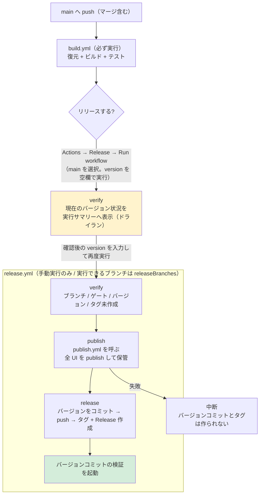

# リリース手順（GitHub Actions）

本ドキュメントは ClipboardZenHanConverter の**リリース作業を行う開発者**向けの情報です。
開発環境（ビルド・テスト・CI）は [`CONTRIBUTING.md`](CONTRIBUTING.md)、他のリポジトリへの流用方法は [`REUSING.md`](REUSING.md)、
アプリの利用方法は [`../README.md`](../README.md) を参照してください。

リリースは **手動実行のみ**です。バージョンの**自動インクリメントは行いません**。

## 構成

リリースの設定と処理は、次のファイルが持ちます。**同じ知識を複数箇所に置かない**ことが設計方針です。

| ファイル | 内容 |
| --- | --- |
| [`release-config.json`](release-config.json) | プロダクト名、バージョンファイル、**ビルド対象のソリューション ファイル**、ゲートのワークフロー、**リリースを許可するブランチ**、配布する UI の定義 |
| [`actions/read-config`](actions/read-config/action.yml) | `release-config.json` を読んで各ワークフローへ渡す共通アクション（読み取りの実装はここだけ） |
| [`../Directory.Build.props`](../Directory.Build.props) | リリースバージョン（`<Version>`）。各 `.csproj` では指定しない |
| [`../global.json`](../global.json) | .NET SDK のバージョンと**テスト ランナー**（Microsoft.Testing.Platform）。ワークフローでは指定しない |
| [`workflows/publish.yml`](workflows/publish.yml) | 全 UI の publish とアーティファクト保管の実装（`release.yml` が呼ぶ） |
| [`scripts/version.ps1`](scripts/version.ps1) | バージョンの規則（形式・比較・系列・プレリリース判定・タグの列挙） |

UI の追加・変更は **`release-config.json` の `uis[]` を編集します**（ワークフローとスクリプトの変更は不要です）。
**ビルド・テストの対象は `solutionFile` が持ちます**（ワークフローには書きません）。
**リリースを許可するブランチは `releaseBranches` が持ちます**（本リポジトリは `["main", "release/**"]`。
`release/` 配下は **`release/<major>.<minor>` の形式**に限定され、入力バージョンの系列と一致させる必要があります）。

```text
<リポジトリルート>/
├── Directory.Build.props     # リリースバージョン（各 .csproj では指定しない）
├── global.json               # .NET SDK のバージョンとテスト ランナー（ワークフローでは指定しない）
├── buildScript/              # UI ごとの publish 手順（release-config.json の uis[].script が指す）
└── .github/
    ├── release-config.json        # リリース設定（リポジトリ固有の設定はこのファイルのみ）
    ├── actions/
    │   └── read-config/
    │       └── action.yml         # release-config.json を読む共通アクション
    ├── dependabot.yml             # GitHub Actions / NuGet の更新 PR
    ├── RELEASE.md                 # 本ドキュメント
    ├── REUSING.md                 # 他のリポジトリへの流用方法
    ├── CONTRIBUTING.md            # 開発環境（ビルド・テスト・CI）
    ├── rulesets/
    │   └── tag-version.json       # Tag ruleset の定義（Settings へインポートする）
    ├── scripts/
    │   ├── version.ps1            # バージョンの規則
    │   ├── set-version.ps1        # バージョンファイルの書き換え（冪等）
    │   ├── verify-release-version.ps1  # リリース可否の検証
    │   └── show-current-versions.ps1   # 現在のバージョン状況の表示
    └── workflows/
        ├── build.yml              # push / PR でビルド・テスト（配布物は作らない）
        ├── publish.yml            # 全 UI の publish と保管（release.yml から呼ばれる）
        └── release.yml            # 手動実行で検証・publish・タグ・Release 作成
```

**注意事項**:

- リリースバージョンは `Directory.Build.props` の `<Version>` に記載し、**各 `.csproj` には記載しないでください**。
  リリース時に `release.yml` がこの 1 行を入力値へ書き換えてコミットします。
- **.NET SDK のバージョンは `global.json` に記載し、ワークフローには記載しないでください**
  （ワークフローは `actions/setup-dotnet` を使わず、ランナー イメージの SDK をそのまま使います。
  `rollForward: latestFeature` のため、イメージの 10.0 SDK で `global.json` の要件を満たします）。
- **テスト ランナー（`test.runner`）も `global.json` が単一所有します。** xunit.v3 4 系は Microsoft.Testing.Platform（MTP）で
  実行するため、`test.runner` に `Microsoft.Testing.Platform` を指定します（未指定だと VSTest ターゲットが使われて失敗します）。
  MTP モードではテスト対象を `--solution` / `--project` で指定してください（位置引数はテスト アプリへの引数として扱われます）。
- 同じ設定を複数箇所に置かないでください（例: UI の定義をワークフローへ直接書く、ソリューション名をワークフローへ書く、バージョンを `.csproj` にも書く、SDK のバージョンをワークフローにも書く）。
  変更時の注意事項は [`REUSING.md`](REUSING.md) にも記載しています。
- **`build.yml` / `publish.yml` / `release.yml` は Windows 固有のターゲットを含むため、ビルド系のジョブは
  `windows-latest` で実行します**（`release.yml` の検証のみ `ubuntu-latest`）。

## 依存関係の更新（Dependabot）

[`dependabot.yml`](dependabot.yml) が、GitHub Actions と NuGet パッケージの更新 Pull Request を作成します。

| 対象 | 間隔 | まとめ方 |
| --- | --- | --- |
| GitHub Actions（`uses:` で参照しているアクション） | 毎週月曜 09:00（Asia/Tokyo） | すべてを 1 つの Pull Request にまとめる |
| NuGet（`src/` と `test/` の各プロジェクト） | 毎月 | minor / patch を 1 つの Pull Request にまとめる |

**注意事項**:

- Dependabot の Pull Request は**読み取り専用トークン・シークレット無し**で実行されます。`build.yml` はシークレットを使わないため、CI はそのまま動作します。
- **NuGet のメジャー更新は作成されません**（テストの書き方が変わるため、手動で判断します）。
- Dependabot は**指定したディレクトリ直下のみを走査します**（再帰しません）。プロジェクトを増やした場合は
  `dependabot.yml` の `directories` にも追加してください。
- Pull Request の内容を確認して `main` へマージします（マージ方式は Squash merge を推奨）。マージ後の `main` への push で `build.yml`（ゲート）が実行されます。
- 破壊的な変更（`actions/upload-artifact` のメジャー更新など）は、CI が失敗した内容を確認して修正します。

## リポジトリの設定（初回のみ）

次はワークフローでは設定できません。リポジトリの **Settings** で有効化します。

### タグの保護（Tag ruleset）

タグ（`v*`）の作成・更新・削除をワークフロー経由に限定します。定義は
[`rulesets/tag-version.json`](rulesets/tag-version.json) にあります。

| 項目 | 値 |
| --- | --- |
| Ruleset name | `Protect version tags` |
| Target | **Tags** |
| Enforcement status | **Active** |
| Target tags | `v*`（内部的には `refs/tags/v*`） |
| Tag protections | **Restrict creations** / **Restrict updates** / **Restrict deletions** / **Block force pushes** |
| Bypass list | **GitHub Actions**（アプリ。ID `15368`） |

**設定手順**:

1. **Settings → Rules → Rulesets** を開く
2. **New ruleset** のドロップダウンから **Import a ruleset** を選び、`rulesets/tag-version.json` を指定する
   - インポートできない場合は **New tag ruleset** で上表のとおり手動設定する
3. 内容を確認して **Create** を押下する

**注意事項**:

- `release.yml` は `GITHUB_TOKEN`（= GitHub Actions アプリ）でタグを作成するため、**bypass に GitHub Actions を追加しないとリリースが失敗します**。
- 導入後は、**Actions → Release** を 1 度実行してタグ作成が通ることを確認してください。
- ローカルからの `git push origin v0.2.0` や `git push --tags` は拒否されます（タグは Release 実行時に作成します）。
- 定義を変更した場合は、**同じ JSON の値と実際の ruleset を一致**させてください（ruleset はコードから自動適用されないため、変更時は手動で更新します）。

## ワークフロー

| ワークフロー | 実行契機 | 内容 |
| --- | --- | --- |
| [`workflows/build.yml`](workflows/build.yml) | `main` への push、`main` 向け PR（**必ず実行**）、`release/**` への push、手動実行（dev など任意のブランチ） | 復元・ビルド・テスト（**配布物は作らない**） |
| [`workflows/publish.yml`](workflows/publish.yml) | `workflow_call` | 全 UI の publish と保管の単一実装（`version` を受け取るとそのバージョンでビルドする） |
| [`workflows/release.yml`](workflows/release.yml) | **手動実行のみ。実行ブランチは `releaseBranches` に従う**（`version` 未入力ならドライラン） | 検証 → 全 UI の publish → バージョンコミット → タグ + GitHub Release 作成 |

`build.yml` の成功実行はリリースの**前提（ゲート）**です。`release.yml` は、リリース対象コミットに対する `build.yml` の成功実行が存在することを確認してから Release を作成します。

**配布物を作る処理は重い（Native AOT を含む）ため、push では実行しません。** 配布物の作成はリリース時に 1 度だけ行います。

**各ジョブには `timeout-minutes` を設定しています**（停止した場合に既定の 6 時間待たないため）。
ビルド・テスト・検証・公開は 30 分、設定の読み取りは 10 分、配布物の作成（`publish.yml` の `publish`）は 60 分です。
なお、再利用ワークフローを呼ぶジョブ（`release.yml` の `publish`）には指定できないため、タイムアウトは呼び先の `publish.yml` が持ちます。



## リリース手順

1. `dev` の変更を `main` へマージ（push）する
2. `Actions` → **Build** が成功するまで待つ（`dev` への push では Build は実行されません）
3. **現在のバージョンを確認する**（まだ `version` を入力しない）
   - `Actions` → **Release** → `Run workflow` を開き、**実行ブランチに `main` を選び、`version` を空欄のまま実行**する
   - リリースは行われず、**実行サマリーに現在のバージョン（`<Version>`・タグ・GitHub Release・配布物）が表示されます**
   - リリース前の事前確認であるため、実行ブランチの検証やゲートの確認も行いません（失敗しません）
4. サマリーの「`version` に入力する値」を確認し、`version` にリリースするバージョンを入力して、もう一度 **Run workflow** を実行する
5. ログの「結果をまとめ」でバージョン・タグ・対象コミットを確認する
6. <https://github.com/tomokuni/ClipboardZenHanConverter/releases> に配布物が添付されていることを確認する

**注意事項**:

- **リリースできるブランチは `release-config.json` の `releaseBranches` が決めます**（本リポジトリは `["main", "release/**"]`）。
  `verify` ジョブが最初に実行ブランチを検証し、含まれない場合は失敗します。
  `release/` 配下のブランチは **`release/<major>.<minor>`**（例: `release/0.1`）にしてください。
- **`version` が未入力の場合はドライランになります。** 現在のバージョン状況の表示だけを行い、
  検証・publish・タグ作成・Release 作成は実行しません（成功として終了します）。
  実行名は `Release （現在のバージョンを確認）` になります。
- **入力フォームには現在のバージョンを表示できません。** `workflow_dispatch` の入力の `default` には式を
  指定できないため（GitHub Actions の仕様）、静的な文字列しか設定できません。
  入力フォームの説明文にも「未入力のまま実行すると現在のバージョンだけを Summary に表示する」旨を記載しています。
  なお、**前回の Release 実行のサマリーはリリース前の状態**なので、リリース直後は「今出したバージョン」が
  載っていません。最新の状態はドライランで確認してください。
- 実行サマリーに表示される項目は、実行ブランチ、**リリース可能なブランチ**、`Directory.Build.props` の `<Version>`、
  タグの最大、**系列（`major.minor`）ごとのタグの最大**（系列が 2 つ以上ある場合）、最新の GitHub Release、
  最新の GitHub Release に添付されている配布物の一覧です。
- **`version` には、比較対象より大きいバージョンを入力します。** 比較対象は同じ系列のタグの最大です
  （サマリーの「`version` に入力する値」を参照）。
  - **通常のリリース**: 例では「全タグの最大」が目安になります（新しい系列を出す場合を除き、同じ系列の最大と一致します）
  - **バックポート（旧系列へのリリース）**: 対象系列のタグの最大と比較されるため、全タグの最大より小さくても入力できます
    （例: `v1.0.0` がある状態で `0.1.2` をリリース）
- **`main` からのバックポートでは `Directory.Build.props` のバージョンを書き換えません**（main のバージョンを旧系列へ
  戻さないため）。配布物には入力したバージョンが適用され、タグと GitHub Release は通常どおり作成されます。
- 同じ系列の中で既存以下のバージョンは検証で失敗します（同値の再リリースも不可）。
- サマリーの値はリリース前の状態です。通常のリリースでは、リリース後に `version` と
  `Directory.Build.props` の `<Version>` が入力値へ更新されます。
- サマリーを表示するステップが失敗しても、リリースは中止されません（情報の表示のみで、状態を変更しません）。
  GitHub への問い合わせに失敗した項目は「なし」として表示されます。
- 実行一覧（`Actions` → **Release**）では、実行名が **`Release <入力したバージョン>`** になります
  （どのバージョンを出した実行かを一覧で判別できます。ドライランは `Release （現在のバージョンを確認）`）。

## バージョンの指定

semver 形式で入力します。数値部分の**先頭 0 は使用できません**。

| 入力例 | 意味 |
| --- | --- |
| `0.2.0` | 通常のリリース |
| `1.0.0` | メジャーリリース |
| `1.2.3-rc.1` | プレリリース（GitHub 上もプレリリースとして登録される） |

プレリリース識別子は `-rc.1` のように**数値をドットで区切る形式を推奨**します。`-rc1` のような形式は辞書順で比較されるため（semver 仕様）、`rc10` が `rc2` より小さくなります。

### FileVersion について

プレリリース部分は **`InformationalVersion`（エクスプローラーの「製品バージョン」）にのみ反映**されます。
`AssemblyVersion` / `FileVersion` は数値 4 桁しか許されないため、`1.2.3-rc.1` でも **`FileVersion` は `1.2.3.0`** になります。rc と正式版をファイルのプロパティで区別する場合は「製品バージョン」を参照してください。

## 検証される条件

`release.yml` は次をすべて満たさない場合に失敗します。

| # | 条件 | 失敗する例 |
| --- | --- | --- |
| 1 | 実行ブランチが `releaseBranches` に一致する（完全一致またはワイルドカード） | `dev` を選んで実行 |
| 2 | `release/X.Y` の場合、入力バージョンの系列が `X.Y` に一致する | `release/0.1` に `0.2.0` を入力 |
| 3 | 対象コミットに対する `build.yml` の**成功実行がある** | push 直後（Build 実行中・失敗）に実行 |
| 4 | バージョンが semver 形式（先頭 0 不可） | `1.2`、`01.2.3` |
| 5 | **同じ系列のタグの最大より大きい** | `v0.1.1` があるのに `0.1.1` を入力 |
| 6 | タグ `v<version>` が**未作成** | 既存と同じバージョンを入力 |

条件 5・6 により、**同値の入力も失敗**します（同じバージョンの再リリースはできません）。

## バックポートリリース

古い系列の保守リリースは、`release/<major>.<minor>` ブランチから実行します。

```text
例: v1.0.0 をリリース済みで、0.1 系に修正を出したい場合

1. release/0.1 ブランチを作成し、修正を cherry-pick する
2. release/0.1 へ push する（Build が成功するまで待つ）
3. Actions → Release → Run workflow で
   実行ブランチに release/0.1 を選び、version に 0.1.2 を入力する
```

| 実行ブランチ | 比較対象 | 例（タグ: v0.1.1 / v1.0.0） | バージョンファイル | Latest |
| --- | --- | --- | --- | --- |
| `main`（新しい系列） | 入力バージョンと**同じ系列**の最大 | `1.0.1` は OK / `1.0.0` は失敗（同値） | 書き換える | 更新する |
| `main`（旧系列を入力＝バックポート） | 同上 | `0.1.2` は OK（同じ系列の最大 `0.1.1` より大きい） / `0.1.1` は失敗（同値） | **書き換えない**（main のバージョンを旧系列へ戻さないため） | 更新しない |
| `release/0.1` | 同じ系列の最大 | `0.1.2` は OK / `1.0.1` は失敗（系列不一致） | 書き換える | 更新しない |

系列ブランチ（`release/X.Y`）と、`main` からのバックポートでは次を自動で行います。

- `--latest=false`（古い系列を Latest にしない）
- `--notes-start-tag v0.1.1`（リリースノートの範囲を系列内に限定）

なお、`main` から旧系列のバージョン（例: `v1.0.0` がある状態で `0.1.2`）をリリースした場合は、
`main` の `Directory.Build.props` を旧系列へ戻さないため**バージョンファイルを書き換えません**。

## Release の添付ファイル

添付するファイルは `release-config.json` の `uis[].asset` が決めます。`release.yml` は保管された成果物をそのまま添付するため、**UI を追加してもワークフローは変更不要**です。

| UI | 添付ファイル | zip の中身 |
| --- | --- | --- |
| MewUI 版 | `ClipboardZenHanConverter.App.MewUI.zip` | exe 1 個（Native AOT） |
| WinUI 3 版 | `ClipboardZenHanConverter.App.WinUI3.zip` | exe 1 個（自己完結） |
| Avalonia UI 版 | `ClipboardZenHanConverter.App.AvaloniaUI.zip` | exe 1 個 + ネイティブ DLL 3 個 |
| WinForms 版 | `ClipboardZenHanConverter.App.WinForms.zip` | exe 1 個（自己完結） |

**すべて zip で配布します。** `uis[].zip` が `true` の UI は、publish 後に配布物を zip 化してから保管します
（出力が単一ファイル（exe）でもフォルダでも同じ指定で扱えます）。

publish は `buildScript/` の `*_publish_*.bat` をそのまま実行するため、ローカルでの配布用ビルドと同一の手順・出力になります。
スクリプトは `buildScript/` からリポジトリルートへ移動してから実行されるため、カレントディレクトリに依存しません。

## 失敗した場合の復旧

`release.yml` は **publish の成功後に push・タグ作成・Release 作成**を行います。そのため途中で失敗してもタグと Release は作成されません。

| 失敗したジョブ | 状態 | 復旧方法 |
| --- | --- | --- |
| `verify` | 何も変更されていない | 条件を満たして再実行する |
| `publish` | 何も変更されていない（push 前） | **同じバージョンで再実行**する |
| `release`（push 後） | ブランチは push 済み・タグ未作成 | **同じバージョンで再実行**する（バージョン設定が冪等なため再試行できる） |

- 失敗した実行を「Re-run」しても**その実行時のワークフロー定義**が使われるため、定義を修正した場合は再実行せず、新しく `Run workflow` してください。

## リリース後の検証（バージョンコミット）

リリース時のバージョン更新コミットは `GITHUB_TOKEN` による push のため、`build.yml` が自動では起動しません（`GITHUB_TOKEN` の push はワークフローを起動しない）。
そこで `release.yml` が push 後に [`gh workflow run`](https://docs.github.com/en/rest/actions/workflows) で `build.yml` の検証を起動します（`workflow_dispatch` は例外として起動できる）。

- バージョンコミットにもチェックが付き、**テストが実行される**（リリースされたコミットが未検証にならない）。
- 検証が成功すると、そのコミットが次のリリースのゲートを満たす。**リリース直後でも続けて次のリリースが可能**。
- 検証の起動は非同期です（完了は待ちません）。結果は `Actions` → Build で確認してください。

## ローカルでの確認

スクリプトはローカルでも実行できます。

```powershell
# バージョンを設定する（バージョンファイルを更新。冪等）
& ./.github/scripts/set-version.ps1 -Version 0.2.0

# リリース可否を事前確認する（形式・ブランチ・系列・単調性・タグ未作成）
$info = & ./.github/scripts/verify-release-version.ps1 -Version 0.2.0 -Branch main | ConvertFrom-Json
$info.tag           # -> v0.2.0
$info.notesStartTag # -> v0.1.1
$info.prerelease    # -> False

# 現在のバージョン状況を確認する（読み取りのみ。ネットワークを使わない場合は -NoNetwork）
& ./.github/scripts/show-current-versions.ps1 -Branch main
```

バージョンの規則（形式・比較）だけを確認する場合は、ライブラリを直接使えます。

```powershell
. ./.github/scripts/version.ps1
ConvertTo-SemanticVersion -Version '1.2.3-rc.1'   # 不正なら例外
Get-VersionSeries -Version '1.2.3'                # -> 1.2
Get-MaxVersion -Versions @('1.0.0', '1.2.0')      # -> 1.2.0
```

## 注意点

- ワークフローが `main`（または `release/X.Y`）へ push するため、**ブランチ保護**で `github-actions[bot]` の push が拒否される場合は許可設定（または PAT への切り替え）が必要です。
- `release.yml` は `actions: write` 権限を使用します（ゲートの参照と、バージョンコミットの検証の起動）。
- **`build.yml` は配布物を作成しません。** ゲートはビルドとテストの成功であり、配布物が作成できることはリリース実行時に初めて検証されます
  （publish の失敗はタグとバージョンを消費しません。上の「失敗した場合の復旧」を参照）。
- `dev` への push では `build.yml` を実行しません。`dev` で検証する場合は `workflow_dispatch`（手動実行）を使用してください。
- 配布物（アーティファクト）の保持期間は `release-config.json` の `artifactRetentionDays`（既定 30 日）です。
  保持期間を過ぎると `release.yml` の `release` ジョブが成果物を取得できなくなるため、リリースは publish の直後に完了させてください。
- `release.yml` の `publish` と `release` は別ジョブのため、バージョンは 2 回適用されます（publish は作業ツリーのみ、release はコミット）。どちらも冪等で、同一の入力から同一の成果物になります。
