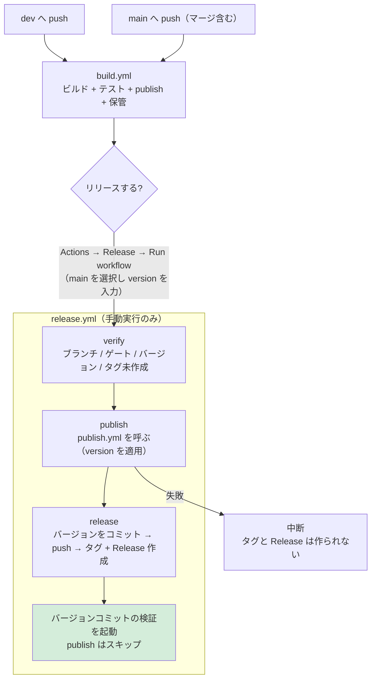

# リリース手順（GitHub Actions）

本ドキュメントは ClipboardZenHanConverter の**リリース作業を行う開発者**向けの情報です。
開発環境（ビルド・テスト・CI）は [`CONTRIBUTING.md`](CONTRIBUTING.md)、他のリポジトリへの流用方法は [`REUSING.md`](REUSING.md)、
アプリの利用方法は [`../README.md`](../README.md) を参照してください。

リリースは **手動実行のみ**です。バージョンの**自動インクリメントは行いません**。

## 設計

リリースに関する設定と手順は、次の 3 つに集約しています。**同じ知識を複数箇所に置かない**ことが設計方針です。

| 単一ソース | 内容 |
| --- | --- |
| [`release-config.json`](release-config.json) | プロダクト名、バージョンファイル、ゲートのワークフロー、UI の定義（名前・publish スクリプト・出力・配布名・zip の要否） |
| [`workflows/publish.yml`](workflows/publish.yml) | 全 UI の publish とアーティファクト保管（`build.yml` と `release.yml` が共通で呼ぶ） |
| [`scripts/version.ps1`](scripts/version.ps1) | バージョンの規則（形式・比較・系列・プレリリース判定） |

UI の追加・変更は **`release-config.json` を編集するだけ**です（ワークフローとスクリプトの変更は不要）。

## ワークフロー

| ワークフロー | 実行契機 | 内容 |
| --- | --- | --- |
| [`workflows/build.yml`](workflows/build.yml) | `main` / `dev` / `release/**` への push、`main` 向け PR、手動 | ビルド・テスト・全 UI の publish・アーティファクト保管（**登録は行わない**） |
| [`workflows/publish.yml`](workflows/publish.yml) | `workflow_call` | publish と保管の単一実装（`version` を受け取るとそのバージョンでビルドする） |
| [`workflows/release.yml`](workflows/release.yml) | **手動実行のみ** | 検証 → publish → タグ作成 → GitHub Release 作成 |

`build.yml` の成功実行はリリースの**前提（ゲート）**です。`release.yml` は、リリース対象コミットに対する `build.yml` の成功実行が存在することを確認してから Release を作成します。



## リリース手順

1. `dev` の変更を `main` へマージ（push）する
2. `Actions` → **Build** が成功するまで待つ
3. `Actions` → **Release** → `Run workflow` を開く
4. **実行ブランチに `main` を選び**、`version` にリリースするバージョンを入力して実行する
5. ログの「結果をまとめ」でバージョン・タグ・対象コミットを確認する

## バージョンの指定

semver 形式で入力します。数値部分の**先頭 0 は使用できません**。

| 入力例 | 意味 |
| --- | --- |
| `0.2.0` | 通常のリリース |
| `1.0.0` | メジャーリリース |
| `1.2.3-rc.1` | プレリリース（GitHub 上もプレリリースとして登録される） |

プレリリース識別子は `-rc.1` のように**数値をドットで区切る形式を推奨**します。`-rc1` のような形式は辞書順で比較されるため（semver 仕様）、`rc10` が `rc2` より小さくなります。

### FileVersion について

プレリリース部分は **`InformationalVersion`（エクスプローラーの「製品バージョン」）にのみ反映**されます。
`AssemblyVersion` / `FileVersion` は数値 4 桁しか許されないため、`1.2.3-rc.1` でも **`FileVersion` は `1.2.3.0`** になります。rc と正式版をファイルのプロパティで区別する場合は「製品バージョン」を参照してください。

## 検証される条件

`release.yml` は次をすべて満たさない場合に失敗します。

| # | 条件 | 失敗する例 |
| --- | --- | --- |
| 1 | 実行ブランチが `main` または `release/<major>.<minor>` | `dev` を選んで実行 |
| 2 | 対象コミットに対する `build.yml` の**成功実行がある** | push 直後（Build 実行中・失敗）に実行 |
| 3 | バージョンが semver 形式（先頭 0 不可） | `1.2`、`01.2.3` |
| 4 | `main`: **全タグの最大より大きい** | `v2.0.0` があるのに `1.3.0` を入力 |
| 5 | `release/X.Y`: 入力の系列が `X.Y` に一致し、**`vX.Y.*` の最大より大きい** | `release/1.2` に `1.3.0` を入力 |
| 6 | タグ `v<version>` が**未作成** | 既存と同じバージョンを入力 |

条件 4・5 により、**同値の入力も失敗**します（同じバージョンの再リリースはできません）。

## バックポートリリース

古い系列の保守リリースは、`release/<major>.<minor>` ブランチから実行します。

```text
例: v2.0.0 をリリース済みで、1.2 系に修正を出したい場合

1. release/1.2 ブランチを作成し、修正を cherry-pick する
2. release/1.2 へ push する（Build が成功するまで待つ）
3. Actions → Release → Run workflow で
   実行ブランチに release/1.2 を選び、version に 1.2.2 を入力する
```

| 実行ブランチ | 比較対象 | 例（タグ: v1.2.1 / v2.0.0） |
| --- | --- | --- |
| `main` | **全タグ**の最大 | `2.0.1` は OK / `1.3.0` は失敗（誤った系列への逆戻りを防ぐ） |
| `release/1.2` | `v1.2.*` の最大 | `1.2.2` は **OK（バックポート）** / `1.2.1` は失敗（同値） |

バックポートでは次を自動で行います。

- `--latest=false`（古い系列を Latest にしない）
- `--notes-start-tag v1.2.1`（リリースノートの範囲を系列内に限定）

## Release の添付ファイル

添付するファイルは `release-config.json` の `uis[].asset` が決めます。`release.yml` は保管された成果物をそのまま添付するため、**UI を追加してもワークフローは変更不要**です。

| UI | 添付ファイル | 形式 |
| --- | --- | --- |
| MewUI 版 | `ClipboardZenHanConverter.App.MewUI.exe` | 単一 exe（Native AOT） |
| WinUI 3 版 | `ClipboardZenHanConverter.App.WinUI3.exe` | 単一 exe（自己完結） |
| Avalonia UI 版 | `ClipboardZenHanConverter.App.AvaloniaUI.zip` | exe + ネイティブ DLL 3 個 |
| WinForms 版 | `ClipboardZenHanConverter.App.WinForms.exe` | 単一 exe（自己完結） |

publish はリポジトリ直下の `*_publish_*.bat` をそのまま実行するため、ローカルでの配布用ビルドと同一の手順・出力になります。

## 失敗した場合の復旧

`release.yml` は **publish の成功後に push・タグ作成・Release 作成**を行います。そのため途中で失敗してもタグと Release は作成されません。

| 失敗したジョブ | 状態 | 復旧方法 |
| --- | --- | --- |
| `verify` | 何も変更されていない | 条件を満たして再実行する |
| `publish` | 何も変更されていない（push 前） | **同じバージョンで再実行**する |
| `release`（push 後） | ブランチは push 済み・タグ未作成 | **同じバージョンで再実行**する（バージョン設定が冪等なため再試行できる） |

- 失敗した実行を「Re-run」しても**その実行時のワークフロー定義**が使われるため、定義を修正した場合は再実行せず、新しく `Run workflow` してください。

## リリース後の検証（バージョンコミット）

リリース時のバージョン更新コミットは `GITHUB_TOKEN` による push のため、`build.yml` が自動では起動しません（`GITHUB_TOKEN` の push はワークフローを起動しない）。
そこで `release.yml` が push 後に [`gh workflow run`](https://docs.github.com/en/rest/actions/workflows) で `build.yml` の検証を起動します（`workflow_dispatch` は例外として起動できる）。

- バージョンコミットにもチェックが付き、**テストが実行される**（リリースされたコミットが未検証にならない）。
- **バージョン更新のみのコミットでは publish をスキップ**する。このようなコミットの配布物はリリース時に作成済みで、AOT ビルドの再実行は無駄になるため。
- 検証が成功すると、そのコミットが次のリリースのゲートを満たす。**リリース直後でも続けて次のリリースが可能**。

| コミットの種類 | ビルド | テスト | publish |
| --- | --- | --- | --- |
| ソース変更を含む | 実施 | 実施 | 実施 |
| バージョン更新のみ（バージョンファイルだけの変更） | 実施 | 実施 | **スキップ** |

検証の起動は非同期です（完了は待ちません）。結果は `Actions` → Build で確認してください。

## ローカルでの確認

スクリプトはローカルでも実行できます。

```powershell
# バージョンを設定する（バージョンファイルを更新。冪等）
& ./.github/scripts/set-version.ps1 -Version 0.2.0

# リリース可否を事前確認する（形式・系列・単調性・タグ未作成）
$info = & ./.github/scripts/verify-release-version.ps1 -Version 0.2.0 -Branch main | ConvertFrom-Json
$info.tag           # -> v0.2.0
$info.notesStartTag # -> v0.1.1
$info.prerelease    # -> False
```

バージョンの規則（形式・比較）だけを確認する場合は、ライブラリを直接使えます。

```powershell
. ./.github/scripts/version.ps1
ConvertTo-SemanticVersion -Version '1.2.3-rc.1'   # 不正なら例外
Get-VersionSeries -Version '1.2.3'                # -> 1.2
Get-MaxVersion -Versions @('1.0.0', '1.2.0')      # -> 1.2.0
```

## 注意点

- ワークフローが `main`（または `release/X.Y`）へ push するため、**ブランチ保護**で `github-actions[bot]` の push が拒否される場合は許可設定（または PAT への切り替え）が必要です。
- `release.yml` は `actions: write` 権限を使用します（ゲートの参照と、バージョンコミットの検証の起動）。
- `build.yml` は `main` / `dev` / `release/**` への push のたびに publish します（ドキュメントのみの変更でも実行されます）。これはリリースのゲートを常に満たすためです。バージョン更新のみのコミットではスキップされます。
- アーティファクトの保持期間は `release-config.json` の `artifactRetentionDays`（既定 30 日）です。リリース時に改めて publish するため、保管はゲートの記録と確認用です。
- `release.yml` の `publish` と `release` は別ジョブのため、バージョンは 2 回適用されます（publish は作業ツリーのみ、release はコミット）。どちらも冪等で、同一の入力から同一の成果物になります。
