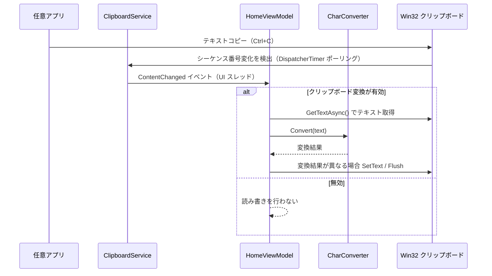

# ClipboardZenHanConverter.App.AvaloniaUI システム仕様書

本ドキュメントは `src/app_AvaloniaUI`（Avalonia UI アプリ）のシステム仕様（概要・技術スタック・アーキテクチャ・構成・動作仕様）を記載します。
メソッド内部のコードは記載しません。

## システム概要

クリップボードのテキストを監視し、設定に基づいて全角/半角変換を実行してクリップボードへ書き戻す Windows デスクトップアプリです。
UI フレームワークとして Avalonia UI（クロスプラットフォームの XAML フレームワーク）を使用します。

全角/半角変換は常に有効です（オン/オフの切り替えはありません）。切り替えできるのはクリップボード連携（コピーの検知と変換結果の書き戻し）のみで、`AppSetting.IsClipboardConvertEnabled` が保持します。

## 技術スタック

- .NET 10
- Avalonia UI 12.*（`Avalonia` / `Avalonia.Desktop` / `Avalonia.Themes.Fluent` / `Avalonia.Fonts.Inter`）
- AvaloniaUI.DiagnosticsSupport 2.*（Debug 構成のみ。廃止された `Avalonia.Diagnostics` は使用しません）
- CommunityToolkit.Mvvm 8.*（変換設定・ViewModel）
- Microsoft.Extensions.Hosting 10.*（DI）
- EsUtil.Helper.ZenHanConverter（変換ペア、`src/core` 経由）

## 共有コア

`src/core` は UI に依存しない共有ライブラリです。モデル・変換ロジック・Win32 API・アイコンデータ・変換カテゴリ定義を提供し、
仕様は `../core/SPEC_ExtFunc.md` と `../core/SPEC_System.md` を参照してください。

Avalonia アプリは `src/core` と `src/core_presentation` のみを参照し、`src/app_MewUI` / `src/app_WinUI3` / `src/app_WinForms` とは相互依存しません。
3 つのアプリは同一の設定ファイル（`%LOCALAPPDATA%\ClipboardZenHanConverter`）を共有します。

```mermaid
flowchart LR
    AppMewUI[src/app_MewUI (MewUI)] -->|参照| Core[src/core (UI 非依存)]
    AppWinUI3[src/app_WinUI3 (WinUI 3)] -->|参照| Core
    AppAvalonia[src/app_AvaloniaUI (Avalonia UI)] -->|参照| Core
    Core -->|PackageReference| EsUtil[EsUtil.Helper.ZenHanConverter]
    AppAvalonia -->|PackageReference| Avalonia[Avalonia UI]
```

## ビルドと配置

### 通常ビルド

```powershell
dotnet build src/app_AvaloniaUI/app_AvaloniaUI.csproj
dotnet run --project src/app_AvaloniaUI/app_AvaloniaUI.csproj
```

### 配布用ビルド（Native AOT）

リポジトリルートの `AvaloniaUI_publish_aot.bat`（ビルド）と `AvaloniaUI_run_publish.bat`（ビルドして起動）で、Native AOT の配布用フォルダーを
`publish\avaloniaui-<RID>-aot\` に出力します（既定 RID は `win-x64`、exe 1 個 + DLL 3 個 約 43.8 MB）。

必要なプロパティは次のとおりです。

1. `PublishAot=true`（IL をネイティブコードへ事前コンパイル。起動が速く .NET ランタイム不要）
2. `StripSymbols=true`（ネイティブシンボルを exe から除去）
3. `SelfContained=true`

`OptimizationPreference` は既定（`Speed`）を使用します。

出力は exe（`ClipboardZenHanConverter.App.AvaloniaUI.exe`）と、SkiaSharp のネイティブ DLL（`libSkiaSharp.dll` / `av_libglesv2.dll` /
`libHarfBuzzSharp.dll`）です。**フォルダー単位で配布**する必要があります。
`.pdb` は配布対象外のため出力先へ配置しません。

発行はリポジトリ外の一時領域（`%TEMP%\czhc-aot-avalonia-<RID>`）で行い、exe と DLL のみを出力先へ配置します。  
リポジトリ内へ直接発行するとフレームワーク配置のファイルが出力先へ混在します。さらに、プロジェクトディレクトリ配下に
`publish` が存在するとその内容がアプリのコンテンツとして取り込まれ、出力が肥大化します。

### 単一 exe にできない理由

Avalonia の描画は SkiaSharp のネイティブライブラリに依存します。Native AOT はマネージアセンブリを exe へ静的リンクしますが、
ネイティブライブラリは同梱できないため、`libSkiaSharp.dll` / `av_libglesv2.dll` / `libHarfBuzzSharp.dll` を exe の隣に配置する必要があります
（`IncludeNativeLibrariesForSelfExtract=true` を併用しても同梱されません。exe 単体で起動すると `DllNotFoundException: libSkiaSharp` で失敗します）。
本アプリは実行速度と初回起動時間を優先し、AOT を採用しています（MewUI 版と同じ方式です）。

### 描画バックエンド

Avalonia の Windows 既定の `Win32PlatformOptions.RenderingMode` は `AngleEgl`（GPU）→ `Software`（CPU）の順で試行します。
`av_libglesv2.dll`（ANGLE）を出力から削除すると約 5.4 MB 減りますが、描画はソフトウェアレンダリングへ切り替わります。
本アプリは GPU 描画を優先するため、`av_libglesv2.dll` を配布対象に含めています。

## アーキテクチャ

```text
src/app_AvaloniaUI
├── Program.cs               エントリポイント（Avalonia 構成・起動）
├── App.axaml / App.axaml.cs アプリケーション（DI 構築・メインウィンドウ表示）
├── app.manifest             Windows 用マニフェスト
├── Styles/
│   └── AppStyles.axaml      共有スタイル（セグメント選択・ウィンドウ操作ボタンの ControlTheme）
├── Converters/
│   └── StringNotEmptyToBoolConverter.cs
├── Helpers/
│   └── FluentIcons.cs        Core のパスデータからアイコン形状を生成
├── Services/
│   ├── ClipboardService.cs
│   ├── INavigationService.cs
│   ├── NavigationService.cs
│   └── DependencyInjectionExtensions.cs
├── ViewModels/
│   ├── MainWindowViewModel.cs
│   ├── HomeViewModel.cs
│   ├── SettingsViewModel.cs
│   ├── PresetEditDialogViewModel.cs
│   ├── ZenHanConvertItem.cs
│   ├── SegmentOption.cs
│   ├── ReplacePairItem.cs
│   └── NavigationItem.cs
├── Views/
│   ├── MainWindow.axaml(.cs)
│   ├── HomeView.axaml(.cs)
│   ├── SettingsView.axaml(.cs)
│   ├── PresetEditDialog.axaml(.cs)
│   ├── MessageDialog.axaml(.cs)
│   └── Controls/
│       └── CategorySection.axaml(.cs)
└── (変換カテゴリ定義は src/core/Models/SegmentDefinitions、ウィンドウ位置補正は src/core/Helpers/WindowPlacement が所有)
```

## コンポーネント構成

| コンポーネント | 責務 |
| --- | --- |
| `ClipboardService` | クリップボード読み書き・変更監視（ポーリング）。Win32 P/Invoke は Core.Native、変更検出は Core.Logic の ClipboardChangeDetector へ委譲 |
| `INavigationService` / `NavigationService` | タグからビューを解決し、キャッシュして再利用。事前生成（PreloadView）にも対応 |
| `MainWindowViewModel` | ナビゲーション項目と選択状態の保持、選択項目に対応する画面の解決、タイトルバーが参照する設定の公開 |
| `HomeViewModel` | クリップボードイベント受信→変換→書き戻し（クリップボード変換の有効/無効に従う） |
| `SettingsViewModel` | 変換設定の編集・置換ルール・プリセット管理・JSON 入出力（プリセット選択の単一所有元） |
| `PresetEditDialogViewModel` | プリセット名の検証と保存/削除の可否判定 |
| `ZenHanConvertItem` / `SegmentOption` | 変換項目と選択肢の表示状態の保持（設定との双方向同期） |
| `CategorySection` | カテゴリ 1 セクションの表示（見出し・説明・項目一覧・補足）を 8 カテゴリで共有 |
| `MainWindow` | カスタムタイトルバー・ナビゲーションペイン・ウィンドウ位置とサイズの復元/保存 |
| `FluentIcons` | Core のパスデータから Avalonia のアイコン形状を生成（初回のみ） |

## シーケンス（クリップボード変換）



## ナビゲーション

`MainWindow` は左ペイン（`ListBox`）とコンテンツ領域（`ContentControl`）を `Grid` で並べ、選択項目のタグから
`MainWindowViewModel` → `INavigationService.ResolveView` 経由でビュー（`HomeView` / `SettingsView`）を解決します。ビューはキャッシュされ再利用されます。

ぺインの幅は展開時 104 DIP／折りたたみ時 44 DIP で、ウィンドウを狭めても常に表示されます（重なり表示はしません）。
タイトルバー左端のペイン開閉ボタンで幅を切り替えます。折りたたみ時は `ListBox` に `compact` クラスを付け、
項目のラベルを非表示にしてアイコンのみを中央に表示します。`Grid` の列は `Auto,*` のため、
幅を狭めるとその分コンテンツ領域が広がります。

ペイン項目のアイコン色は `TextControlForeground`（テーマの主要テキスト色）を参照します。
これにより明暗テーマの切替に追従し、項目の文字色とも一致します。

> MewUI 版・WinUI 3 版はフレームワーク標準の `NavigationView` を使用します。Avalonia 12 の `DrawerPage` は
> 幅のしきい値でペインをオーバーレイ表示へ切り替える（＝狭い幅でペインが内容へ重なる）ため、
> 重なり表示を避けて `ListBox` + `ContentControl` の 2 ペイン構成を採用しています。

## カスタムタイトルバー

`WindowDecorations="None"` + `ExtendClientAreaToDecorationsHint="True"` としてアプリが装飾を描画します。

| 要素 | `WindowDecorationProperties.ElementRole` | 効果 |
| --- | --- | --- |
| タイトルバーの背景（`Border`） | `TitleBar` | ドラッグ移動・ダブルクリック最大化 |
| ペイン開閉ボタン・クリップボード変換スイッチ・プリセット選択・ウィンドウ操作ボタンの各要素 | `User` | 操作系コントロールが入力を受け取る |
| 外周の各辺・各角（8 個の `Border`） | `ResizeN` / `ResizeS` / `ResizeE` / `ResizeW` / `ResizeNE` / `ResizeNW` / `ResizeSE` / `ResizeSW` | リサイズ |

- タイトルバーの高さは 36 DIP、境界は `Grid` の行定義で確保します。
- 操作系コントロールを含む領域に `User` を指定しない場合、タイトルバー（ドラッグ領域）が入力を横取りし、
  スイッチやコンボボックスが反応しません。
- ウィンドウ操作ボタンは自前の `Click` ハンドラーで `WindowState` と `Close` を操作します。
  最大化ボタンの表示は `WindowState` の変化に応じて最大化（□）/復元（❐）へ切り替えます。
- スイッチとラベルは詰めて並べます。既定の `ToggleSwitch` テンプレートはトラックと内容の間に 12 DIP の固定余白列を持つため、
  ラベル側に負の余白（-10 DIP）を指定して打ち消します。
- プリセット選択の幅は指定せず、項目（プリセット名）の文字幅に合わせて自動で決めます（`MinWidth` を指定しない）。

## ホーム画面（上下 2 分割）

- 上下のペインは `Grid` の行の重み（`*`）で保持し、間に `Auto` 行の分割バーを置きます。
- 比率を重みで保持するため、**ウィンドウの高さが変化しても上下の比率が維持されます**。
- 分割バーは `Thumb` の `DragDelta` でドラッグ量を受け取り、Core の `SplitLayout.RatioFromDrag` で比率へ換算して上下限（0.1〜0.9）で補正します。
- 分割バーは 1px の区切り線を中央に描き、残りの領域をドラッグの当たり判定に使用します（背景を `Transparent` にしてヒットテスト可能にします）。

## 設定画面

### セグメント選択

`ZenHanConvertItem.Options`（`SegmentOption`）を `RadioButton` へ双方向バインドします。

- `RadioButton` のテンプレートは `AppStyles.axaml` の `SegmentRadioButton`（`ControlTheme`）で差し替え、`:checked` / `:pointerover` / `:disabled` を疑似クラスで表現します。
- 排他選択のグループは `SegmentOption.GroupName`（項目ごとに一意な連番）を `GroupName` へ指定して確立します。親要素の推定に依存しないため、行をまたいだ干渉がありません。
- 選択状態は `IsSelected` → `ZenHanConvertItem.SelectedLabel` → `ConvertConfig` の順に反映され、逆方向（設定変更・プリセット読み込み・インポート）は `ConvertConfig.PropertyChanged` から再同期します。相互更新はフラグで保護します。

### カテゴリセクション

`CategorySection` が見出し・説明・項目一覧・補足を表示し、8 カテゴリで共有します。
項目一覧は `WrapPanel` で折り返すため、項目数・幅に応じて自然に複数列となります。

> MewUI 版・WinUI 3 版は「名称部の幅を揃え、記号部を固定枠へ中央寄せにする」マルチカラム整列を行います。
> Avalonia 版は `WrapPanel` による折り返しのみとし、行内の整列（名称部の幅揃え）は行いません。
> 選択肢・設定項目・変換結果は他 UI と同一です。

### 文字列の置換

置換行は `ItemsControl` で 1 行ずつ表示し、検索文字列・置換文字列（`TextBox`）・正規表現（`CheckBox`）・削除ボタンを持ちます。
編集内容は変更の都度検証され、有効な行のみが `ConvertConfig.ReplacePairs` へ反映されます。
検証エラーは行の直下に表示します。

> MewUI 版は行の再構築、WinUI 3 版は `DataGrid` と編集ダイアログを使用します。Avalonia 版は行内で直接編集します。

### 設定の管理

ヘッダー直下に固定し、スクロールしません。

- 左寄せ: プリセット選択（`SettingsViewModel.SelectedPresetName` に双方向バインド）＋「プリセット編集」
- 右寄せ: 「エクスポート (JSON)」＋「インポート (JSON)」

ファイルの選択は Avalonia の `TopLevel.StorageProvider` を使用し、パスの解決のみを View が担います。

## アイコンアセット

使用するアイコンの形状は SVG ファイル（Fluent Icons 24px regular）を唯一の定義元とし、パスデータの二重管理を排除します。
SVG は `src/core/Icons` が埋め込みリソースとして所有し、`EsUtil.ClipboardZenHanConverter.Core.Icons.FluentIconData` が初回アクセス時に
ファイル名一致で読み込み、パスデータ（d 属性の値）を抽出して保持します。
Avalonia 側の `FluentIcons` がそのパスデータを `Geometry.Parse` でベクター形状へ変換して保持します。
アイコンデータを Core に置くことで 3 つの UI で同じアイコン形状を利用できます。

## 設定の保存と復元

永続化される設定は 3 種類です。いずれも `%LOCALAPPDATA%\ClipboardZenHanConverter` 配下へ JSON で保存します。

| 設定 | ファイル | 内容 |
| --- | --- | --- |
| `AppSetting` | `AppSetting.json` | ウィンドウの位置・サイズ、クリップボード連携の有効/無効 |
| `ConvertConfig` | `Settings.json` | 全角/半角変換のモード設定、置換ルール |
| プリセット | `Presets\{名前}.json` | ユーザー定義プリセット（組込みは組み込み定義） |

起動時は `App` が `Initialize()` を呼び、ウィンドウを構築する前に各設定を読み込みます（以降の UI は読み込み済みの値を初期表示します）。
通常の変更はデバウンス（300ms）付きの自動保存で書き込まれます。
終了時（`Closed`）はデバウンスを待たず、`AppSetting` と `ConvertConfig` を同期で保存します（直前の変更が失われるのを防ぐため）。

## ウィンドウ位置・サイズの復元と保存

起動時は `AppSetting.WindowWidth` / `WindowHeight`（DIP）を `Window.Width` / `Height` へ復元します。
ウィンドウ位置（`AppSetting.WindowX` / `WindowY`、DIP）は表示直後（`Opened`）に、DPI スケールを掛けて物理ピクセルへ換算して適用します。
位置が未保存の場合は中央に表示します。終了時（`Closed`）は現在の位置とクライアントサイズ（DIP）を `AppSetting` へ書き戻し、同期で JSON 保存します。

保存位置が表示領域外の場合は Core の `ScreenVisibleArea.Clamp` で補正します（DIP の取得と物理ピクセルとの換算も同クラスが担います）。

- 一部が表示領域外: はみ出した辺を表示領域の内側へ詰めて表示
- 完全に表示領域外: 原点（プライマリモニタの左上）へ移動

表示領域は仮想画面（全モニタの外接矩形）を `Win32Display` が物理ピクセルで取得し、DPI スケールで DIP へ換算したものです。
このためマルチモニタ構成でも、いずれかのモニタが見えていればその位置を維持します。

### 実装上の注意（Avalonia 固有）

- **位置の情報源**: `Window.Position` プロパティはドラッグ等の外部起点の移動を反映しないため、`PositionChanged` で追跡した値を保存に使用します（`Position` プロパティは値を設定した直後の読み戻しにのみ使用）。
- **DPI スケール**: `Closed` の時点では `RenderScaling` を取得できない（1.0 になる）ため、`ScalingChanged` と起動時に保持した値を保存に使用します。
- **通常状態の値**: 最大化/最小化中に終了した場合は、通常状態での最後の位置とサイズを保存します（最大化状態を次回起動へ引き継がないため）。

## クリップボード変換

`AppSetting.IsClipboardConvertEnabled` が false の場合、`HomeViewModel` はクリップボードの読み取り・書き戻しを一切行いません。
全角/半角変換は常に有効で、ホーム画面の「変更前」テキストボックスへの手動入力に対しても適用されます（クリップボード変換の有効/無効に依存しません）。

処理フロー:

1. `ClipboardService.ContentChanged`（UI スレッド）を受信
2. `SemaphoreSlim` で排他制御（取得できない場合はスキップ）
3. クリップボードからテキスト取得
4. `BeforeText` 更新（変更通知により `ConvertedText` が自動更新）
5. 変換結果が元と異なる場合のみクリップボードへ書き戻し
6. `_isUpdatingClipboard` フラグで書き戻し中の再帰イベントを防止

## プリセットの一致検出

`ConvertConfig.PropertyChanged` を監視し、`FindMatchingPreset()` で現在の設定に一致するプリセット名を自動設定します。
タイトルバーと設定画面のプリセット選択は `SettingsViewModel.SelectedPresetName` を共有し、常に同期します。

## プリセット編集ダイアログのバリデーション

| 条件 | メッセージ | 保存ボタン | 削除ボタン |
| --- | --- | --- | --- |
| 空文字・空白のみ | なし | 無効 | 無効 |
| 組込みプリセット | 組込みプリセットです。 | 無効 | 無効 |
| ファイル名に使用不可文字を含む | 使用できない文字が含まれます。 | 無効 | 無効（該当名は保存できないため存在しない） |
| 半角小文字で built-in/builtin を含む | built-in または builtin は使用できません。 | 無効 | 無効（同上） |
| 既存ユーザープリセット | 既に存在します。 | 有効 | 有効 |
| 新規の有効な名前 | なし | 有効 | 無効 |

バリデーションは名前の変更時にリアルタイム実行します。

## テストプロジェクト

### フォルダ構成

```text
test/app_AvaloniaUI/
├── AssemblyInfo.cs                     並列実行の無効化（プリセット保存先がプロセス全体で共有されるため）
├── Converters/
│   └── StringNotEmptyToBoolConverterTests.cs
└── ViewModels/
    ├── HomeViewModelTests.cs
    ├── PresetEditDialogViewModelTests.cs
    ├── ReplacePairItemTests.cs
    ├── SettingsViewModelTests.cs
    └── ZenHanConvertItemTests.cs
```

- ファイルを書き込むテストは `AutoSaveFileName` と `ConvertConfig.PresetDirectory` を一時ディレクトリへ差し替え、実ユーザーの `%LOCALAPPDATA%` 配下を汚しません。
- `ConvertConfig.PresetDirectory` はプロセス全体で共有される静的状態のため、このアセンブリでは並列実行を無効にしています。

## 例外処理ポリシー

- クリップボードアクセス拒否（`UnauthorizedAccessException` / `COMException`）は握り潰してアプリ動作を継続。
- バックグラウンド/非同期タスクの未処理例外は `Program.SubscribeExceptionHandlers`、UI スレッドの未処理例外は `App` が購読し、
  集約ログを出力したうえで `Handled = true` としてクラッシュを防止します。

## 他 UI（MewUI 版・WinUI 3 版）との差異

| 項目 | 差異 |
| --- | --- |
| ナビゲーションペイン | `NavigationView`（MewUI/WinUI 3）ではなく `ListBox` + `ContentControl` の 2 ペイン構成 |
| カスタムタイトルバー | フレームワーク標準のタイトルバー統合機能が異なるため、`WindowDecorations="None"` + `ElementRole` で実装 |
| セグメント選択 | `Segmented` コントロール（WinUI 3 / MewUI）ではなく、`ControlTheme` を適用した `RadioButton` |
| マルチカラム整列 | 名称部の幅を揃える整列は行わず `WrapPanel` の折り返しのみ |
| 文字列の置換 | `DataGrid` + 編集ダイアログ（WinUI 3）/ 行再構築（MewUI）ではなく、行内での直接編集 |
| クリップボード監視 | WinRT `Clipboard.ContentChanged`（WinUI 3）ではなく、Win32 シーケンス番号のポーリング（MewUI と同一） |
| 全角/半角変換の切り替え UI | 3 つの UI とも持ちません（常に有効） |

選択肢・設定項目・変換結果・プリセット・ウィンドウ位置補正の仕様は 3 つの UI で共通です。
