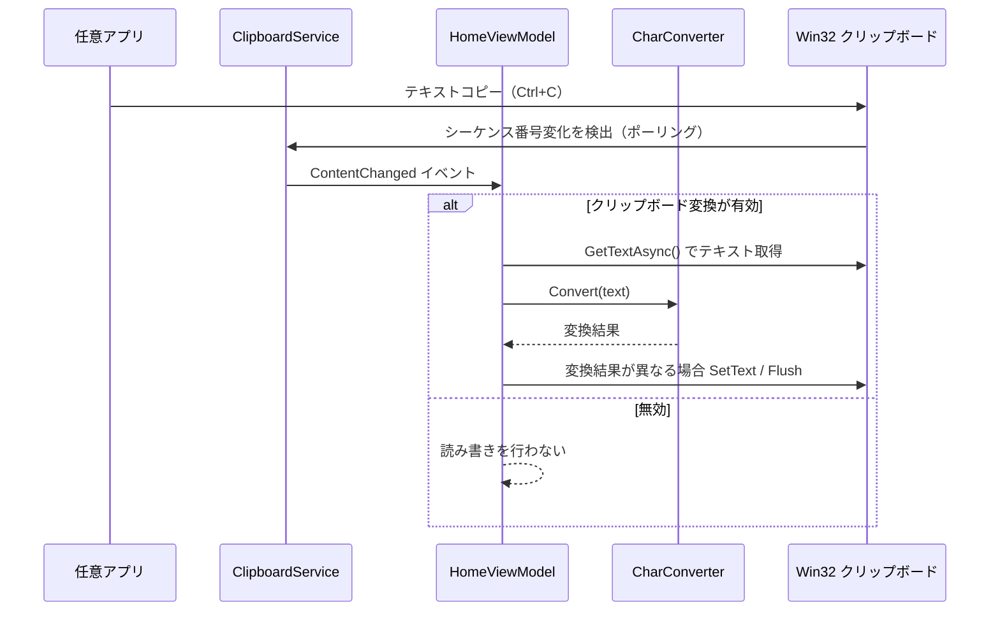

# ClipboardZenHanConverter.App.MewUI システム仕様書

本ドキュメントは `src/app_MewUI`（MewUI アプリ）のシステム仕様（概要・技術スタック・アーキテクチャ・シーケンス・状態遷移）を記載します。
メソッド内部のコードは記載しません。

## システム概要

クリップボードのテキストを監視し、設定に基づいて全角/半角変換を実行してクリップボードへ書き戻す Windows デスクトップアプリです。
UI フレームワークとして MewUI（コードファースト・NativeAOT 対応）を使用します。

全角/半角変換は常に有効です（オン/オフの切り替えはありません）。切り替えできるのはクリップボード連携（コピーの検知と変換結果の書き戻し）のみで、`AppSetting.IsClipboardConvertEnabled` が保持します。

## 技術スタック

- .NET 10
- MewUI（`Aprillz.MewUI.Windows` 0.*）
- CommunityToolkit.Mvvm 8.*（変換設定・ViewModel）
- Microsoft.Extensions.Hosting 10.*（DI）
- EsUtil.Text.ZenHanConverter（変換ペア、`src/core` 経由）
- EsUtil.Algorithm.MultiColumnLayoutEngine 1.*（マルチカラム配置の計算）

## アーキテクチャ

```text
src/app_MewUI
├── Program.cs              エントリポイント（DI 構築・MewUI 起動）
├── Services/               クリップボード・ナビゲーション
│   ├── ClipboardService.cs
│   ├── INavigationService.cs
│   ├── NavigationService.cs
│   └── DependencyInjectionExtensions.cs
├── ViewModels/             MVVM 状態層
│   ├── HomeViewModel.cs
│   ├── SettingsViewModel.cs
│   ├── ZenHanConvertItem.cs
│   └── ReplacePairItem.cs
├── Views/                  コードファースト View 層
│   ├── MainWindow.cs
│   ├── HomeView.cs
│   ├── SettingsView.cs
│   ├── MultiColumnPanel.cs  マルチカラム配置パネル
│   ├── SegmentItems.cs      セグメント構築ヘルパー
│   ├── ViewExtensions.cs    選択・置換行バインディングヘルパー
│   └── Global.cs            メインウィンドウへのアクセサ
├── Helpers/
│   └── FluentIcons.cs         Core のパスデータから MewUI のアイコン形状を生成
└── (変換カテゴリ定義は src/core/Models/SegmentDefinitions、ウィンドウ位置補正は src/core/Helpers/WindowPlacement が所有)
```

## 依存関係

`src/app_MewUI` は `src/core` のみを参照します。`src/core` は MewUI / WinUI3 に依存しません。
`app_MewUI` は「MewUI 固有の View」と「フレームワーク非依存のロジック/モデル/Win32 API」を明確に分離しています。

```mermaid
flowchart LR
    App[src/app_MewUI (MewUI)] -->|参照| Core[src/core (UI 非依存)]
    AppWin[src/app_WinUI3 (WinUI 3)] -->|参照| Core
    Core -->|PackageReference| EsUtil[EsUtil.Text.ZenHanConverter]
    App -->|PackageReference| MewUI[Aprillz.MewUI.Windows]
```

両アプリは同一の設定ファイル（`%LOCALAPPDATA%\ClipboardZenHanConverter`）を共有します。

## コンポーネント構成

| コンポーネント | 責務 |
| --- | --- |
| `ClipboardService` | クリップボード読み書き・変更監視（ポーリング）。Win32 P/Invoke は Core.Native、変更検出は Core.Logic の ClipboardChangeDetector へ委譲 |
| `Win32Clipboard` / `Win32Display`（Core.Native） | Win32 P/Invoke（クリップボードの読み書き・シーケンス番号取得・仮想画面取得）。UI フレームワーク非依存のため Core 層に配置 |
| `INavigationService` | ナビゲーションの抽象（`ResolveView`） |
| `NavigationService` | NavigationView のコンテンツ解決・ビューキャッシュ |
| `HomeViewModel` | クリップボードイベント受信→変換→書き戻し（クリップボード変換の有効/無効に従う） |
| `SettingsViewModel` | 変換設定の編集・プリセット管理・JSON 入出力（プリセット選択の単一所有元） |
| `FluentIcons` | Core のパスデータから MewUI のアイコン形状を生成（初回のみ） |
| `MultiColumnPanel` | 子要素を縦方向の複数列へ配置するパネル（配置計算は MultiColumnLayoutEngine へ委譲） |
| `MainWindow` | ウィンドウ（カスタムタイトルバー: アプリ名 + クリップボード変換スイッチ + プリセット選択 + ウィンドウ操作ボタン）・NavigationView によるナビゲーションシェル |
| `HomeView` / `SettingsView` | 各画面のコードファースト UI |

## シーケンス（クリップボード変換）



## ナビゲーション

`MainWindow` は `NavigationView` をシェルとして使い、ペインの項目（ホーム / 設定）でコンテンツを切り替えます。
`NavigationView.ContentSelector`（`Items` 拡張の `content`）が、選択項目のタグから `NavigationService.ResolveView` 経由でビュー（`HomeView` / `SettingsView`）を解決します。ビューはキャッシュされ再利用されます。
ペイン項目のアイコンは `Items` 拡張の `icon` に `FluentIcons` の形状（ホーム: Convert Range / 設定: Settings）を渡します。

### ペインの配置（PaneDisplayMode）

`PaneDisplayMode` は **`Inline` を明示**します（MewUI の既定は `Auto`）。  
`Auto` は利用可能幅が **1000 DIP 未満**のとき配置を `Overlay` へ切り替えるため、ウィンドウを狭めるとペインが内容の上に重なる形へ変化し、
閉じた状態ではハンバーガーのみが残ってペイン（ホーム / 設定）が消えて見えます。`Inline` を指定すると幅による切替が行われず、
ペインは常に内容の横へ並びます（ハンバーガーで折りたたんでもアイコンレールとして残り、消えません）。  
ウィンドウの最小幅は 720 DIP のため、`Auto` のままだと 720〜1000 DIP の幅でペインが消えます。

## アイコンアセット

使用するアイコンの形状は SVG ファイル（Fluent Icons 24px regular）を唯一の定義元とし、パスデータの二重管理を排除します。
SVG は `src/core/Icons` が埋め込みリソースとして所有し、`EsUtil.ClipboardZenHanConverter.Core.Icons.FluentIconData` が初回アクセス時にファイル名一致で読み込み、パスデータ（d 属性の値）を抽出して保持します。  
MewUI 側の `FluentIcons` がそのパスデータを `PathGeometry.Parse` でベクター形状へ変換して保持します。
アイコンデータを Core に置くことで MewUI / WinUI3 の双方で同じアイコン形状を利用できます。
同一形状の再取得は保持済みインスタンスの返却のみで完結します。

## タイトルバー

`MainWindow` は `ExtendClientAreaTitleBarHeight` でクライアント領域をタイトルバーへ拡張し、カスタムタイトルバーを構築します。
タイトルバーの高さは、操作系コントロール（クリップボード変換スイッチ・プリセット選択）が縮小・クリップされない下限（コントロール標準高さ 28）に合わせて詰めます。
`Window` の既定スタイルが設定する `ContainerPadding`（8）はコンテンツ全周の余白になり、タイトルバーとウィンドウ操作ボタンがウィンドウ端から離れて見えるため、`Padding` を `Thickness.Zero` で打ち消します。
タイトルバーにはアプリ名、クリップボード変換の有効/無効スイッチ、プリセット選択ドロップダウン、ウィンドウ操作ボタン（最小化/最大化/復元/閉じる）を配置します。
プリセット選択ドロップダウンは、高さを詰めたタイトルバーの上端へ張り付かないよう、上側に余白を確保します。
プリセット選択ドロップダウンの幅は指定せず、項目（プリセット名）の文字幅に合わせて自動で決めます。
クリップボード変換スイッチは `AppSetting.IsClipboardConvertEnabled` を単一所有し、ホーム画面・設定画面からは重複配置を排除しています。
プリセット選択は `SettingsViewModel.SelectedPresetName` を単一所有元とし、設定画面と同一実装（`ViewExtensions.BindSelectedPreset`）を共有します。クリップボード変換スイッチの有効/無効では Disable になりません。
ウィンドウ操作ボタンは Win32 バックエンドがネイティブのキャプションボタンを提供しないため常に表示し、`Window.Minimize` / `Maximize` / `Restore` / `Close` を呼び出します。最大化ボタンのアイコンは `WindowStateChanged` に応じて最大化/復元へ切り替えます。ボタンの背景はホバー/押下のビジュアル状態で変化し、閉じるボタンは赤系の配色になります。
タイトルバーのアプリ名・余白領域は、マウスダウンで `Window.DragMove`（ウィンドウ移動）、`MouseDoubleClick` で最大化ボタンと同じ切り替え（`Maximize` / `Restore`）を行います。ウィンドウ操作ボタンと操作系コントロールには、これらの操作を設定しません。

## ホーム画面（上下 2 分割）

- 上下の分割は MewUI の `SplitPanel` に委譲します（`SplitterThickness` で分割バーの太さを指定）。
- 上下の長さは `FirstLength` / `SecondLength` をスターサイズ（`GridLength.Star`）で指定するため、
  **ウィンドウの高さが変化しても上下の比率が維持されます**。
- `MinFirst` / `MinSecond` でペインの最小高さを確保し、どちらかが操作不能な高さにならないようにします。
- 分割バーのドラッグとリサイズカーソルは `SplitPanel` が提供します（他 UI のように比率の計算を自前で行う必要はありません）。

## 設定画面のマルチカラム

記号の変換は項目数が多いため、`MultiColumnPanel` でマルチカラム表示します（項目数が少ない他のカテゴリは単一列）。
`MultiColumnPanel` は子要素を列ごとに縦へ積み、最大列高さを最小化する配置を UI 非依存の `MultiColumnLayoutEngine` に解かせ、算出された各アイテムの座標とサイズをそのまま配置へ反映します。
測定で得た子要素サイズを入力とし、配置時は測定結果を再利用するため再計算は行いません。
列幅はエンジンが列ごとに算出します（列幅 = その列の最大アイテム幅）。変換項目行の幅は名称の長さに依存するため、列ごとに必要な幅が割り当てられ、列幅は列ごとに異なります。

変換項目行のラベルは「名称　記号」形式のため、名称部と記号部に分割して表示します。整列方法はセクションの構成に応じて 2 通りあります。

- 単一列セクション: 名称部の幅をグループ内の最大値に固定し、記号部は最大記号幅の枠へ中央寄せにします。行は内容幅のまま左寄せとなり、記号部の枠とセグメントコントロールの横位置が縦に揃います。
- マルチカラムセクション: 名称部は自然幅のまま、記号部は最大記号幅の固定枠へ中央寄せにして枠を行の右端へ寄せます。行は列幅で配置されるため、記号部の枠とセグメントコントロールは各列の右端で縦に揃い、名称部は各列の左端に揃います。

行幅が名称の長さに依存するマルチカラムセクションでは、列ごとに必要な幅が割り当てられ、列幅は列ごとに異なります。

## 設定の保存と復元

永続化される設定は 3 種類です。いずれも `%LOCALAPPDATA%\ClipboardZenHanConverter` 配下へ JSON で保存します。

| 設定 | ファイル | 内容 |
| --- | --- | --- |
| `AppSetting` | `AppSetting.json` | ウィンドウの位置・サイズ、クリップボード連携の有効/無効 |
| `ConvertConfig` | `Settings.json` | 全角/半角変換のモード設定、置換ルール |
| プリセット | `Presets\{名前}.json` | ユーザー定義プリセット（組込みは組み込み定義） |

起動時は `Program` が `Initialize()` を呼び、ウィンドウ・設定画面を構築する前に各設定を読み込みます（以降の UI は読み込み済みの値を初期表示します）。
通常の変更はデバウンス（300ms）付きの自動保存で書き込まれます。
終了時（`Closed`）はデバウンスを待たず、`AppSetting` と `ConvertConfig` を同期で保存します（直前の変更が失われるのを防ぐため）。

設定画面のセグメント表示は項目の選択状態を購読するため、プリセットの読み込みや設定のインポートで外部から設定が変わっても表示が追従します。

## ウィンドウ位置・サイズの復元と保存

起動時は `AppSetting.WindowWidth` / `WindowHeight`（DIP）を初期サイズとして復元します（`Window.WindowSize` へ指定）。
ウィンドウ位置（`AppSetting.WindowX` / `WindowY`、DIP）は表示直後（`Loaded`）に適用します。初回描画より前に適用されるため、最初のフレームから保存位置で表示されます。位置が未保存の場合は中央に表示します。
終了時（`Closed`）は現在の位置とクライアントサイズ（DIP）を `AppSetting` へ書き戻し、デバウンスを待たず同期で JSON 保存します（デバウンス待ちではプロセス終了に間に合わないため）。
最大化/最小化中に終了した場合は、通常状態での最後の位置とサイズを保存します（最大化状態を次回起動へ引き継がないため）。
なお `Window.RestoreBounds` は OS 起点の最大化で最大化後の値を返すため採用せず、通常状態の値（`ClientSizeChanged` と `WindowStateChanged`、およびドラッグ移動の完了時）を自前で追跡します。

保存位置が表示領域外の場合は `ScreenVisibleArea.Clamp`（Core の Win32 依存を吸収したヘルパー）で補正します。  
呼び出し側で MewUI の `Point` / `Size` / `Rect` を Core の `PointD` / `SizeD` / `RectD`（DIP 座標）へ変換します。

- 一部が表示領域外: はみ出した辺を表示領域の内側へ詰めて表示（ウィンドウ全体が見える位置へ移動）
- 完全に表示領域外: 原点（プライマリモニタの左上）へ移動

表示領域は仮想画面（全モニタの外接矩形）を `Win32Display` が物理ピクセルで取得し、ウィンドウの DPI スケールで DIP へ換算したものです。このためマルチモニタ構成でも、いずれかのモニタが見えていればその位置を維持します。

## クリップボード変換

`AppSetting.IsClipboardConvertEnabled` が false の場合、`HomeViewModel` はクリップボードの読み取り・書き戻しを一切行いません。
全角/半角変換は常に有効で、ホーム画面の「変更前」テキストボックスへの手動入力に対しても適用されます（クリップボード変換の有効/無効に依存しません）。

## プリセットの一致検出

`ConvertConfig.PropertyChanged` を監視し、`FindMatchingPreset()` で現在の設定に一致するプリセット名を自動設定します。
タイトルバーと設定画面のプリセット選択は `SettingsViewModel.SelectedPresetName` を共有し、常に同期します。

## テスト

`test/app_MewUI` 配下にソースファイル每の単体テストを置きます（xUnit v3）。
UI を起動せずに実行できる範囲を対象とします。ファイルを書き込むテストでは `AutoSaveFileName` を一時ディレクトリへ差し替えます。

| テスト | 対象 |
| --- | --- |
| `Helpers/FluentIconsTests` | Core のパスデータからのアイコン形状生成 |
| `ViewModels/ZenHanConvertItemTests` | 設定との連動と選択ラベルの反映 |
| `ViewModels/ReplacePairItemTests` | 編集値とバリデーション |
| `ViewModels/SettingsViewModelTests` | 項目生成、設定同期、プリセット、入出力 |
| `ViewModels/HomeViewModelTests` | 表示用変換とクリップボード連携（スタブ使用） |

## 例外処理ポリシー

- クリップボードアクセス拒否（`UnauthorizedAccessException` / `COMException`）は握り潰してアプリ動作を継続。
- UI/バックグラウンド/非同期タスクの未処理例外は `Program.SubscribeExceptionHandlers` で集約ログを出力し、UI 例外は `Handled = true` でクラッシュを防止。
