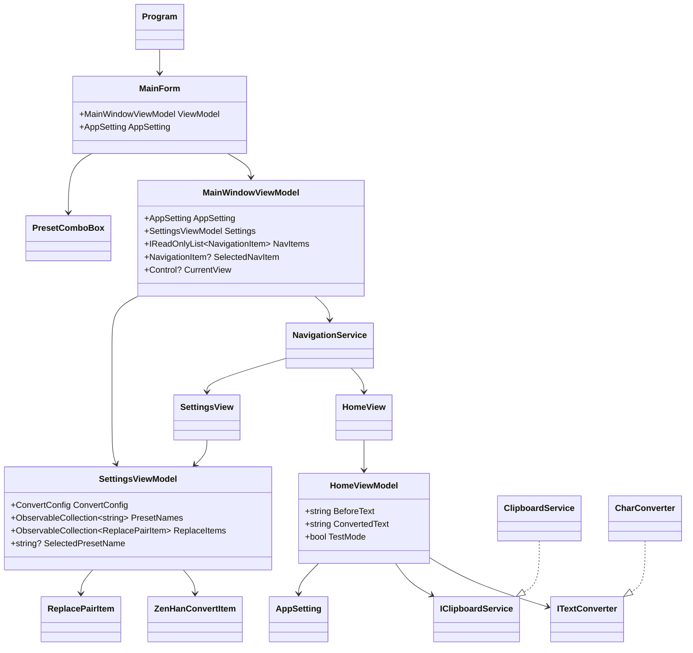
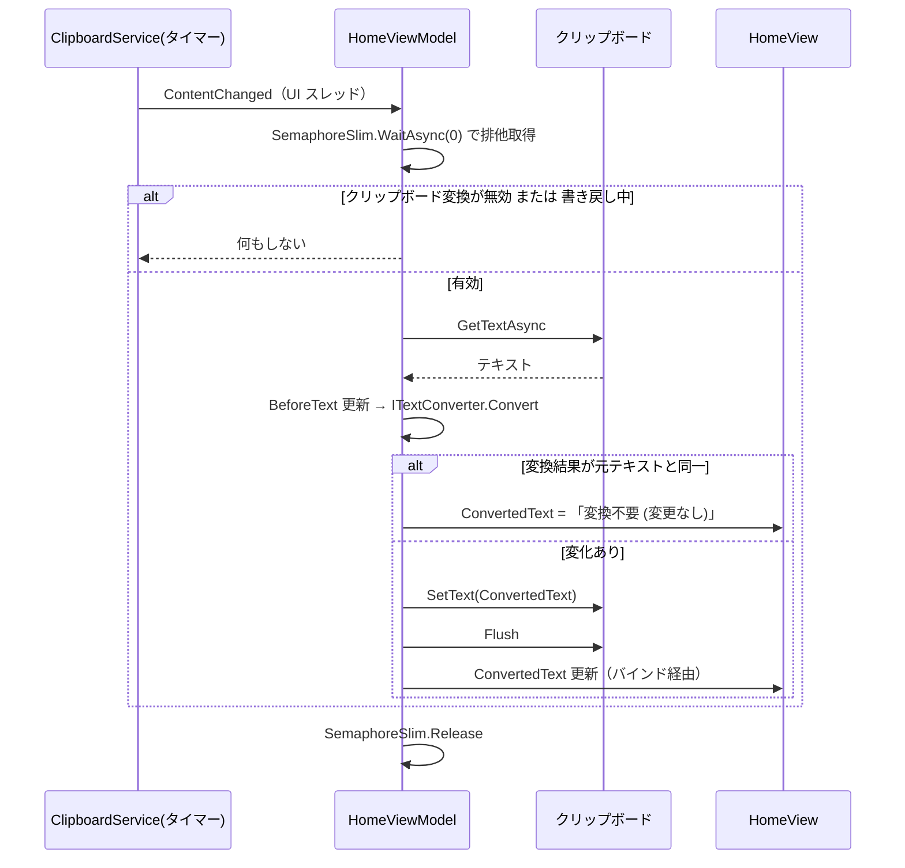

# ClipboardZenHanConverter.App.WinForms システム仕様書

本ドキュメントは `src/app_WinForms`（WinForms アプリ）の内部設計を記載します。
メソッド内部のコードは記載しません。

## システム概要

クリップボードのテキストを監視し、全角/半角の自動変換を行う Windows 向けデスクトップアプリケーションです。
UI フレームワークに **Windows Forms**（.NET 10）を使用します。

**全角/半角変換は常に有効です**（オン/オフの切り替えはありません）。切り替えできるのはクリップボード連携（コピーの検知と変換結果の書き戻し）のみで、`AppSetting.IsClipboardConvertEnabled` が保持します。

## 技術スタック

- .NET 10
- Windows Forms（`UseWindowsForms` / `net10.0-windows`）
- CommunityToolkit.Mvvm 8.*（変換設定・ViewModel）
- Microsoft.Extensions.Hosting 10.*（DI）
- EsUtil.Text.ZenHanConverter（変換ペア、`src/core` 経由）

## 共有コア

`src/core` は UI フレームワークに依存しない共有ライブラリです。モデル・変換ロジック・Win32 API・アイコンデータ・変換カテゴリ定義を提供し、
仕様は `../core/SPEC_ExtFunc.md` と `../core/SPEC_System.md` を参照してください。

設定画面の ViewModel（`SettingsViewModel` など）は `src/core_presentation` が提供します。
仕様は `../core_presentation/SPEC_ExtFunc.md` と `../core_presentation/SPEC_System.md` を参照してください。

## ビルドと配置

### 通常ビルド

```powershell
dotnet build src/app_WinForms/app_WinForms.csproj
dotnet run --project src/app_WinForms/app_WinForms.csproj
```

### 配布用ビルド（単一 exe）

`buildScript/` の `WinForms_publish_single.bat`（ビルド）と `WinForms_run_publish.bat`（ビルドして起動）で、自己完結の単一 exe を
`publish\winforms-<RID>-single\ClipboardZenHanConverter.App.WinForms.exe` に出力します（既定 RID は `win-x64`、約 119 MB）。
スクリプトはリポジトリルートを基準に動作します。

単一 exe 化に必要なプロパティは次のとおりです。

1. `PublishSingleFile=true`
2. `SelfContained=true`（配布先に .NET ランタイムを要求しない）
3. `DebugType=None`（`.pdb` を配布対象から外す）

初回起動時に依存ファイルを `%TEMP%\.net\ClipboardZenHanConverter.App.WinForms\` へ展開するため、初回のみ起動に時間がかかります。  
また、展開先が破損・残留していると起動に失敗する場合があります。その場合は展開先フォルダを削除してから再起動します。

発行はリポジトリ外の一時領域（`%TEMP%\czhc-single-winforms-<RID>`）で行い、単一 exe のみを出力先へ配置します。  
リポジトリ内へ直接発行するとフレームワーク配置のファイルが出力先へ混在します。さらに、プロジェクトディレクトリ配下に
`publish` が存在するとその内容がアプリのコンテンツとして取り込まれ、単一 exe が肥大化します。

### Native AOT / トリミングの可否

WinForms は Native AOT に対応せず、トリミングもサポートされません（`PublishTrimmed=true` は `NETSDK1175` で失敗します）。
そのため本アプリは AOT もトリミングも使用せず、単一ファイル化のみを行います（MewUI 版・Avalonia UI 版は AOT を使用しています）。
WinUI 3 版と同じ方式です。単一 exe のサイズは .NET ランタイムと WinForms アセンブリの同梱分が支配的です。

## アーキテクチャ

```text
src/app_WinForms
├── Program.cs                   エントリポイント（DI 構築とメッセージループ開始）
├── Services/                    アプリ固有サービス
│   ├── ClipboardService.cs      Win32 クリップボード + シーケンス番号ポーリング（IClipboardService 実装）
│   ├── DependencyInjectionExtensions.cs
│   ├── INavigationService.cs / NavigationService.cs
├── ViewModels/                  画面のデータと操作（UI 非依存）
│   ├── HomeViewModel.cs
│   ├── SettingsViewModel.cs
│   ├── MainWindowViewModel.cs
│   ├── ZenHanConvertItem.cs / SegmentOption.cs / ReplacePairItem.cs
│   └── PresetEditDialogViewModel.cs / NavigationItem.cs
├── Views/                       フォームとコントロール（コードで構築）
│   ├── MainForm.cs              メインウィンドウ（カスタムタイトルバー + ナビゲーション + コンテンツ）
│   ├── HomeView.cs / SettingsView.cs
│   ├── CategorySection.cs / ReplaceSection.cs / SectionStackPanel.cs
│   ├── SegmentButton.cs / ToggleSwitch.cs / PresetComboBox.cs
│   ├── PresetEditDialog.cs / MessageDialog.cs
│   └── AppTheme.cs              配色・寸法・フォントの一元管理
└── Helpers/
    ├── FluentIcons.cs           SVG パスデータからアイコン画像を生成（初回のみ・上限 2 件）
    └── SvgPathParser.cs         SVG パスコマンドを GDI+ の GraphicsPath へ変換
```

依存方向は `Program → Views → ViewModels → Services/Core` の一方向です。



## コンポーネント構成

| コンポーネント | 責務 |
| --- | --- |
| `Program` | DI コンテナ（Microsoft.Extensions.Hosting）の構築、設定の読み込み、集約エラーハンドラー、メッセージループ開始 |
| `MainForm` | カスタムタイトルバー（アプリ名・クリップボード変換スイッチ・プリセット選択・ウィンドウ操作）、ナビゲーション、コンテンツ表示、ウィンドウ位置・サイズの保存と復元 |
| `MainWindowViewModel` | ナビゲーション項目の保持と画面解決の委譲、タイトルバーが参照する設定の公開 |
| `HomeViewModel` | クリップボード変更の監視と自動変換、変換結果の書き戻し |
| `SettingsViewModel` | 8 カテゴリの変換設定、置換ルール、プリセット、JSON エクスポート/インポート |
| `ClipboardService` | Win32 クリップボードの読み書きと `GetClipboardSequenceNumber` のポーリングによる変更検出 |
| `NavigationService` | タグからビューを解決し、インスタンスをキャッシュして再利用 |
| `SectionStackPanel` | セクションを縦一列に配置し、内容に応じた縦スクロールを提供 |
| `CategorySection` | カテゴリ見出し・説明・変換項目一覧（名称 + セグメント選択） |
| `ReplaceSection` | 置換ルールの行（検索文字列・置換文字列・正規表現・削除）とバリデーション表示 |
| `SegmentButton` | 排他選択をボタン列で表示するセグメント用ラジオボタン |
| `ToggleSwitch` | クリップボード変換の有効/無効を切り替えるトグルスイッチ（自前描画） |
| `PresetComboBox` | プリセット選択のドロップダウン（タイトルバーと設定画面で共有） |
| `FluentIcons` / `SvgPathParser` | Core の SVG パスデータからナビゲーションアイコン画像を生成 |

## シーケンス（クリップボード変換）



## ナビゲーション

- ナビゲーションペインは `ListBox`（オーナードロー）で、項目ごとにアイコンとラベルを描画します。
- 幅は展開時 104／折りたたみ時 44（論理ピクセル）で、タイトルバー左端の「☰」ボタンで切り替えます。
- 折りたたみ時はラベルを描画せず、アイコンのみを項目の中央へ描画します。
- `NavigationService` がタグ（"Home" / "Settings"）からビュー型を解決し、DI コンテナ経由で生成したインスタンスをキャッシュします。
- ビューの表示は `MainWindowViewModel.CurrentView` の変更を `MainForm` が購読して行います（キャッシュしたビューは破棄しません）。

## カスタムタイトルバー

`FormBorderStyle=None` として装飾をアプリが描画します。

- 操作系コントロールは左から「ナビゲーション開閉（☰）→ アプリ名 → クリップボード変換スイッチ + ラベル → プリセット選択」、右端に「最小化 / 最大化・復元 / 閉じる」を配置します。
- プリセット選択の幅は固定値ではなく、項目（プリセット名）の文字幅から求めます（最小 120／最大 300 論理ピクセル、文字幅には矢印・余白分の 32 を加算）。
  プリセットの増減で必要な幅が変わるため、一覧の変更時に配置をやり直します。
- スイッチとラベルは詰めて並べます。スイッチは自前描画のため、トラックの外側（四隅）を背景で塗りつぶして残像を防ぎます。
- 枠が無いウィンドウは既定でタスクバーを覆うため、最大化時に `MaximizedBounds` を作業領域へ設定します。

### 移動とリサイズの実装（枠を持たないウィンドウ固有の事情）

枠を持たないウィンドウでは Windows が移動・リサイズの操作を提供しません。また **`WM_NCHITTEST` はその領域を所有する子コントロールに送られる**ため、
子コントロールが覆う範囲に対してフォーム側でヒットテスト結果を返すことはできません。そこで次のように役割を分けています。

| 操作 | 担当 | 実装 |
| --- | --- | --- |
| 移動 | タイトルバーの余白 | マウス押下で `WM_NCLBUTTONDOWN` を `HTCAPTION` 付きで送り、OS のドラッグ操作を開始する（`WindowChrome.BeginDrag`） |
| 最大化/復元 | タイトルバーの余白 | ダブルクリックで `WindowState` を切り替える |
| リサイズ | フォームが所有する外周 | `Padding` で枠の太さ分を確保し、`WM_NCHITTEST` に `HTLEFT` 等を返す |

- 移動を自前でマウス追跡せず OS のドラッグ操作へ委ねるため、スナップ・最大化・マルチモニタの挙動が OS と一致します。
- ドラッグの開始点はタイトルバーの余白・アプリ名ラベル・スイッチのラベルとします（操作系コントロールは自身の入力を受け取るため対象外）。
- タイトルバー内の配置を変えたあとは、以前の位置に残った子コントロールの描画を消すためタイトルバーを無効化（再描画）します。
- リサイズのヒットテストには `Padding` の実値をそのまま使います。`AutoScaleMode.Font` により枠の太さも同じ倍率で拡大されるため、DPI が一致します。
- 枠を持たないウィンドウは外周が描画されないため、`OnPaint` で上辺をタイトルバー・左辺をナビゲーションペインの背景に合わせて塗り、
  最外周に 1px の境界線を引いてウィンドウの範囲を示します。

## ホーム画面（上下 2 分割）

- 上下のペインは `TableLayoutPanel` の割合（`SizeType.Percent`）で保持し、間に分割バー（`SizeType.Absolute`）を置きます。
- 比率を割合で保持するため、**ウィンドウの高さが変化しても上下の比率が維持されます**。
- 分割バーのドラッグ量は Core の `SplitLayout.RatioFromDrag` で比率へ換算し、上下限（0.1〜0.9）で補正します。
- 分割バーは 1px の区切り線のみを描き、残りの領域をドラッグの当たり判定に使用します（カーソルは上下方向のリサイズ）。

## 設定画面

### セグメント選択

- 各変換項目は「名称 + 選択肢」の 1 行で表示します。
- 選択肢は `SegmentButton`（`Appearance.Button` の `RadioButton`）で、排他選択は WinForms の既定動作（同一親要素内で排他）に任せます。
- 選択中の選択肢はアクセント色の背景と白文字で表示します。

### カテゴリセクション

- `CategorySection` は 2 列の `TableLayoutPanel` です。名称列は AutoSize とし、グループ内で最も長い名称に合わせて幅が決まります。
- 見出し・説明・補足は全列を結合して配置し、折り返し幅をセクション幅へ追従させます。
- 変換項目は 1 行に 1 つ配置します（Avalonia UI 版の折り返し配置とは異なりますが、項目の並び順は同一です）。

### 文字列の置換

- 1 つの置換ルールは 4 列（検索文字列・置換文字列・正規表現・操作）と、その下のエラーメッセージ行で表示します。
- 編集内容は `ReplacePairItem`（INotifyPropertyChanged）へ双方向バインドし、検証は ViewModel 側で実行します。
- 一覧の変更（追加・削除・プリセット読み込み）に追従して行を作り直します。

### 設定の管理

- ヘッダー直下に固定し、スクロールしません。
- 左寄せにプリセット選択（`PresetComboBox`）と「プリセット編集」ボタン、右寄せに「エクスポート (JSON)」「インポート (JSON)」を配置します。

## アイコンアセット

- アイコン形状は Core の `FluentIconData`（SVG のパスデータ）を唯一の定義元とし、MewUI 版・WinUI 3 版・Avalonia UI 版と共有します。
- GDI+ には SVG のパーサが無いため、`SvgPathParser` が M / L / H / V / C / S / Q / T / Z（および相対コマンド）を解釈して `GraphicsPath` へ変換します。円弧（A / a）には対応しません。
- 塗りつぶし規則は EvenOdd（`FillMode.Alternate`）です。Fluent Icons の抜き（歯車のリング・中央の輪）は部分パスの重なり回数で表現されているため、この規則で正しく描画できます。
- 生成は初回アクセスのみで、アイコンは 2 種・サイズ固定のためキャッシュは自然に上限 2 件となります。

## 設定の保存と復元

- 保存先は `%LOCALAPPDATA%\ClipboardZenHanConverter\`（`AppSetting.json` / ユーザープリセット）で、他 UI と共有します。
- `SettingsPersistenceBase` のデバウンス付き自動保存（300ms）を利用します。
- 終了時はデバウンスを待たず、`CancelPendingSave` の後に同期で保存します。

## ウィンドウ位置・サイズの復元と保存

- 位置とサイズは DIP で `AppSetting` へ保存し、表示時に DPI スケールで物理ピクセルへ換算します。
- 復元は `OnLoad`（自動スケーリング完了後・初回表示前）で行います。
- 保存位置が表示領域外の場合は Core の `ScreenVisibleArea.Clamp` で見える位置へ補正します。
- 最大化中に終了した場合は、通常状態での最後の位置とサイズを保存します。

## クリップボード変換

- 変更検出は `System.Windows.Forms.Timer`（250ms）で `GetClipboardSequenceNumber` をポーリングし、Core の `ClipboardChangeDetector` に判定を委譲します。
- タイマーは UI スレッドで動くため `ContentChanged` は常に UI スレッドで発行されます。`HomeViewModel` は生成時に捕捉した `SynchronizationContext` を持ち、UI スレッド以外からの通知を UI スレッドへ委譲します。
- 読み書きは Core の `Win32Clipboard` へ委譲し、アクセス拒否時は例外を握り潰して動作を継続します。

## テストプロジェクト

`test/app_WinForms` が `src/app_WinForms` の単体テストを持ちます。

```text
test/app_WinForms
├── Helpers/SvgPathParserTests.cs     SVG パス解釈（アイコンが解釈できることの保証を含む）
└── ViewModels/HomeViewModelTests.cs  表示用変換・書き戻し・UI スレッド委譲・破棄
```

`test/parity` は WinForms 版の ViewModel をソースリンクで取り込み、MewUI 版・WinUI 版と同じ入力に対する
変換結果と設定画面の項目構成が一致することを検証します。

## 例外処理ポリシー

- `Program` が `Application.ThreadException`、`AppDomain.UnhandledException`、`TaskScheduler.UnobservedTaskException` を購読し、`Debug.WriteLine` へ出力します。
- クリップボードのアクセス拒否（`UnauthorizedAccessException` / `COMException` / `ExternalException`）は想定内の通常動作として握り潰します。

## 他 UI（MewUI 版・WinUI 3 版・Avalonia UI 版）との差異

| 項目 | WinForms 版 | 理由 |
| --- | --- | --- |
| 配布方式 | 単一ファイル自己完結（AOT なし） | WinForms は Native AOT に対応せず、トリミングも非サポート（`NETSDK1175`） |
| アイコン描画 | SVG パスデータを `SvgPathParser` で `GraphicsPath` へ変換して描画 | GDI+ に SVG のパーサが無いため |
| 変換項目の配置 | 1 行に 1 項目（折り返しなし） | WinForms のレイアウトで折り返しを再現すると高さ計算が不安定になるため |
| ウィンドウの移動 | タイトルバーのマウス押下で `WM_NCLBUTTONDOWN`（`HTCAPTION`）を送って OS のドラッグ操作を開始 | 子コントロールが覆う領域には `WM_NCHITTEST` が届かないため |
| ウィンドウのリサイズ | フォームが `Padding` で確保した外周で `WM_NCHITTEST` に応答 | 同上 |
| ホーム画面の分割 | `TableLayoutPanel` の割合（`SizeType.Percent`）+ 自前の分割バー | 他 UI には分割の仕組みが標準で用意されているため |
| プリセット未選択の表示 | 空欄 | WinForms の `ComboBox` にプレースホルダーが無いため |
| 削除ボタンの表示 | `✕` の文字 | GDI+ の既定フォントで絵文字が描画できない場合があるため |
| ウィンドウ操作ボタンのグリフ | `—` / `□` / `❐` / `✕` の文字 | 他 UI と同じ文字表現を共有 |
