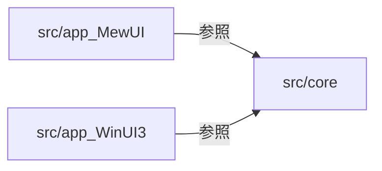

# ClipboardZenHanConverter.App.WinUI システム仕様書

本ドキュメントは `src/app_WinUI3`（WinUI 3 アプリ）のシステム仕様（概要・技術スタック・アーキテクチャ・構成・動作仕様）を記載します。
メソッド内部のコードは記載しません。

## システム概要

クリップボードのテキストを監視し、設定に基づいて全角/半角変換を実行してクリップボードへ書き戻す Windows デスクトップアプリです。
UI フレームワークとして WinUI 3（Windows App SDK）を使用します。

## 技術スタック

- .NET 10
- WinUI 3（`Microsoft.WindowsAppSDK` 2.*）
- CommunityToolkit.Mvvm 8.*（変換設定・ViewModel）
- CommunityToolkit.WinUI.Controls.*（Segmented / SettingsControls / Primitives）
- CommunityToolkit.WinUI.UI.Controls.DataGrid 7.*
- EsUtil.Algorithm.MultiColumnLayoutEngine 1.*（マルチカラム配置の計算）
- Microsoft.Extensions.Hosting 10.*（DI）

マルチカラム配置パネル `MultiColumnPanel` は `Views/Controls` に同梱ソースとして保持し、パッケージ参照を持ちません。
配置計算のみ UI 非依存の `EsUtil.Algorithm.MultiColumnLayoutEngine` へ委譲します。

## 共有コア

`src/core` は MewUI / WinUI3 に依存しない共有ライブラリです。モデル・変換ロジック・Win32 API・アイコンデータ・変換カテゴリ定義を提供し、
仕様は `../core/SPEC_ExtFunc.md` と `../core/SPEC_System.md` を参照してください。

WinUI アプリは `src/core` と `src/core_presentation` のみを参照し、`src/app_MewUI`（MewUI 版）とは相互依存しません。
両アプリは同一の設定ファイル（`%LOCALAPPDATA%\ClipboardZenHanConverter`）を共有します。



## ビルドと配置

### 通常ビルド

```powershell
dotnet build src/app_WinUI3/app_WinUI3.csproj
dotnet run --project src/app_WinUI3/app_WinUI3.csproj
```

### 単一 exe

リポジトリルートの `WinUI3_publish_single.bat`（ビルド）と `WinUI3_run_publish.bat`（ビルドして起動）で、自己完結の単一 exe を
`publish\winui3-<RID>-single\ClipboardZenHanConverter.App.WinUI3.exe` に出力します（既定 RID は `win-x64`）。

単一 exe 化に必要なプロパティは次のとおりです。

1. `WindowsPackageType=None`（非パッケージ。プロジェクトで設定済み）
2. `PublishSingleFile=true`
3. `SelfContained=true`
4. `WindowsAppSDKSelfContained=true`
5. `EnableMsixTooling=true`（埋め込み `resources.pri` の生成に必須）
6. `IncludeAllContentForSelfExtract=true`（DLL の SxS リダイレクトに必須）

### Windows App SDK 未使用ペイロードの除外

`Microsoft.WindowsAppSDK`（`2.*`）は AI / ML / Search / Widgets / WebView2 をサブパッケージとして参照し、その実体は
`Microsoft.WindowsAppSDK.Runtime` の MSIX（`.msix` / `.msixvc` 内の `MSIX\win10-x64\` 以下）に格納されています。
**MSIX はパッケージ参照ではないため `ExcludeAssets` では除外できません。**

そのため `app_WinUI3.csproj` の `RemoveUnusedWindowsAppSdkPayload` ターゲットで、`AfterTargets="ComputeResolvedFilesToPublishList"` の
時点で `ResolvedFileToPublish` から未使用ファイル（`onnxruntime.dll` / `DirectML.dll` / `Microsoft.Windows.AI*` / `Microsoft.Windows.ML*` /
`Microsoft.Windows.Search*` / `Microsoft.Windows.Widgets*` / `Microsoft.Web.WebView2*` / `NPUDetect.dll` / `PerceptiveStreaming.dll` / `msquic.dll`）を除去します。

1. `ComputeResolvedFilesToPublishList` は単一ファイル／フォルダーの両発行で実行されるため、双方で削減が効く
2. 単一ファイル発行では `PrepareForBundle`、フォルダー発行では `CopyFilesToPublishDirectory` の前に除去する

本アプリは AI / ML / Search / Widgets / WebView2 を使用しないため、除外による機能低下はありません（動作確認済み）。
単一 exe で 約 234 MB → 約 179 MB（約 55 MB 削減）。

初回起動時に依存ファイルを `%TEMP%\.net\ClipboardZenHanConverter.App.WinUI3\` へ展開するため、初回のみ起動に時間がかかります。  
また、展開先が破損・残留していると起動に失敗する場合があります。その場合は展開先フォルダを削除してから再起動します。  

発行はリポジトリ外の一時領域（`%TEMP%\czhc-single-winui-<RID>`）で行い、単一 exe のみを出力先へ配置します。  
リポジトリ内へ直接発行するとフレームワーク配置のファイルが出力先へ混在します。さらに、プロジェクトディレクトリ配下に
`publish` が存在するとその内容がアプリのコンテンツ（`App.xaml` / `resources.pri` 等）として取り込まれ、単一 exe が肥大化します。

### Native AOT の可否

WinUI 3 は Native AOT に対応しません。`PublishAot=true` での発行は成功しますが（`CommunityToolkit.WinUI.UI.Controls.DataGrid` の `IL2104` トリム警告のみ）、生成された exe は起動時に `Microsoft.UI.Xaml.dll` でクラッシュします（例外コード `0xc000027b`）。
そのため `WinUI3_publish_single.bat` では AOT を使用しません（MewUI 版は AOT を使用しています）。

## src/app_WinUI3 プロジェクト

### src/app_WinUI3/App.xaml.cs

#### `App` partial class

アプリケーションのエントリポイント。

**静的プロパティ**:

- `Services` (`IServiceProvider`) — DI コンテナのサービスプロバイダー

**静的メソッド**:

- `GetService<T>()` → `T` — DI コンテナから指定型のサービスを取得

**メソッド**:

- `OnLaunched(LaunchActivatedEventArgs args)` — 起動時のメインウィンドウ表示と初期ページ設定

**処理フロー**:

1. コンストラクタで DI コンテナを初期化、AppSetting/ConvertConfig を自動保存モードで起動
2. OnLaunched でメインウィンドウを表示、NavigationService を初期化
3. 集約エラーハンドラー（UI/バックグラウンド/非同期タスク）を購読

---

### src/app_WinUI3/Services/INavigationService.cs

#### `INavigationService` interface

アプリケーション内のページ遷移を管理する抽象（DIP）。

`object?` / UI 要素を扱うため、共有コアではなく `src/app_WinUI3` に配置しています。

**メソッド**:

- `NavigateTo(object? page)` — 指定されたページへ遷移
- `Initialize()` — ナビゲーションサービスを初期化
- `PreloadSettingsAsync()` — SettingsPage をバックグラウンドで事前生成（UI スレッドがアイドルになったタイミング）

---

### src/app_WinUI3/Services/NavigationService.cs

#### `NavigationService` class

アプリケーション内のページ遷移を管理するサービス。

**実装**: `INavigationService`

**内部構造**:

- `_pageMap` (`FrozenDictionary<string, Type>`) — ページ名と型のマッピング（"Home" → HomePage, "Settings" → SettingsPage）
- `_pageCache` (`Dictionary<Type, UIElement>`) — キャッシュされたページインスタンス
- `_currentPageType` (`Type?`) — 現在表示中のページタイプ

**メソッド**:

- `Initialize()` — SettingsPage を事前生成（DispatcherQueue.Low 優先度）
- `NavigateTo(object? selectedPage)` — NavigationViewItem または文字列でページ遷移
- `NavigateToPage(string tag)` — 指定タグ名のページへ遷移（キャッシュあり/なしの分岐、前ページの非表示化、NavigationView の選択状態同期）

**最適化**:

- `FrozenDictionary` による高速ルックアップ
- ページインスタンスのキャッシュによる再生成コスト削減

---

### src/app_WinUI3/Services/ClipboardService.cs

#### `ClipboardService` partial class

システムクリップボードの読み書きと内容変更監視を提供するサービス。

**実装**: `IClipboardService`

**プロパティ/イベント**:

- `ContentChanged` — クリップボード内容変更イベント

**メソッド**:

- `GetTextAsync()` → `Task<string?>` — クリップボードからテキストを非同期取得
- `SetText(string text)` → `void` — クリップボードにテキストを設定
- `Flush()` → `void` — クリップボード内容を永続化
- `RaiseContentChanged()` → `void` — テスト用にイベント発行

**内部メソッド**:

- `OnClipboardContentChanged(object? sender, object e)` — システムイベントハンドラ
- `ClipboardActionSafe(Action action)` — クリップボード操作を安全に実行（アクセス拒否時の例外を無視）

**セーフガード**: バックグラウンド時の `UnauthorizedAccessException` や WinRT 相互運用の `COMException` を握り潰し

---

### src/app_WinUI3/Services/DependencyInjectionExtensions.cs

#### `DependencyInjectionExtensions` static class

DI コンテナへのサービス登録拡張メソッド。

**登録サービス（全てシングルトン）**:

- サービス: `NavigationService`, `ClipboardService`
- コアロジック: `CharConverter`
- モデル: `AppSetting`, `ConvertConfig`
- ViewModel: `MainWindowViewModel`, `HomeViewModel`, `SettingsViewModel`
- View: `MainWindow`, `HomePage`, `SettingsPage`

---

### src/app_WinUI3/ViewModels/MainWindowViewModel.cs

#### `MainWindowViewModel` partial class

メインウィンドウのデータ管理とページ遷移制御。

**依存**: `INavigationService`

**ObservableProperty**:

- `SelectedPage` (`object?`) — 現在選択されているページ（変更時に NavigateTo を自動実行）

---

### src/app_WinUI3/ViewModels/HomeViewModel.cs

#### `HomeViewModel` partial class

ホーム画面のデータ管理、クリップボード監視と文字変換実行。

**実装**: `IDisposable`

**依存**: `ConvertConfig`, `ITextConverter`, `IClipboardService`, `AppSetting`

**ObservableProperty**:

- `BeforeText` (`string`) — 変換前のテキスト
- `ConvertedText` (`string`) — 変換後のテキスト

**プロパティ**:

- `Config` (`ConvertConfig`) — 変換設定
- `TestMode` (`bool`) — テスト用同期実行モード

**処理フロー**:

1. `ClipboardService.ContentChanged` イベント受信
2. `SemaphoreSlim` で排他制御
3. クリップボードからテキスト取得
4. `BeforeText` 更新（変更通知により `ConvertedText` が自動更新）
5. 変換結果が元と異なる場合のみクリップボードに書き戻し
6. `_isUpdatingClipboard` フラグで書き戻し中の再帰イベントを防止

**注意点**:

- 全角/半角変換は常に有効です（オン/オフの切り替えはありません）。変換エンジン（`CharConverter`）だけでなく、この ViewModel も
  `ConvertConfig.IsEnabledZenHan` を参照しません（MewUI 版と同一）
- プリセット選択はタイトルバー（`MainWindow`）が `SettingsViewModel` を介して単一所有し、この ViewModel は関与しません

---

### src/app_WinUI3/ViewModels/SettingsViewModel.cs

#### `SettingsViewModel` partial class

設定画面のデータ管理。

**依存**: `ConvertConfig`

**ObservableProperty**:

- `SelectedPresetName` (`string?`) — 現在選択されているプリセット名

**プロパティ**:

- `ConvertConfig` (`ConvertConfig`) — 変換設定への参照
- `NumberItems` / `AlphabetItems` / `KanaItems` / `SymbolItems` / `EtcZenHanAsciiItems` / `EtcBslashYenItems` / `EtcSpecialItems` / `EtcMultiSpaceItems` — 各変換カテゴリのセグメントアイテム一覧
- `PresetNames` (`ObservableCollection<string>`) — プリセット名の一覧
- `ReplaceItems` (`ObservableCollection<ReplacePairItem>`) — ユーザー定義の置換ルール一覧

**メソッド**:

- `ValidateAllAndSyncToConfig()` — 全置換行をバリデーションし有効な行のみを同期
- `ValidateItemAndSync(ReplacePairItem item)` — 指定行をバリデーションし全行同期
- `ReloadReplaceItemsFromConfig()` — ReplaceItems を ConvertConfig から再構築
- `ExportSettings(string filePath)` — JSON エクスポート
- `ImportSettings(string filePath)` → `string?` — JSON インポート
- `RefreshPresets()` — プリセット一覧を更新
- `SavePreset(string name)` — 現在の設定をプリセットとして保存
- `LoadPreset(string? name)` — プリセットを読み込み（選択名を維持、RefreshSelectedPreset による上書きは行わない）
- `DeletePreset(string? name)` — プリセットを削除

**イベント駆動**:

- `ConvertConfig.PropertyChanged` 購読 → 設定変更を検出し `RefreshSelectedPreset()` を呼び出し
- `OnSelectedPresetNameChanged` — ドロップダウン選択によるプリセット読み込み
- `_isUpdatingSelection` フラグで再帰的読み込みを防止

---

### src/app_WinUI3/ViewModels/ZenHanConvertItem.cs

#### `ZenHanConvertItem` partial class

設定画面の変換項目を表す ViewModel。

**実装**: `IDisposable`

**プロパティ**:

- `Label` (`string`) — 項目のラベル
- `IsEnabled` (`bool`) — コントロールの有効状態
- `ForceEnableState` (`bool?`) — 強制的な有効状態設定
- `Segments` (`SegmentItem[]`) — 選択可能なセグメント定義
- `SelectedLabel` (`string`) — 選択されている項目のラベル（getter/setter）

**最適化**:

- `ConvertConfig.Mode`（型安全なアクセサ定義）を介したプロパティアクセス
- `PropertyChanged` 購読で `SelectedLabel` を再通知

---

### src/app_WinUI3/ViewModels/ReplacePairItem.cs

#### `ReplacePairItem` partial class

置換ルール1行分の ViewModel。

**ObservableProperty**:

- `Search` (`string`) — 検索文字列
- `Replace` (`string`) — 置換文字列
- `IsRegex` (`bool`) — 正規表現フラグ
- `ErrorMessage` (`string?`) — バリデーションエラーメッセージ

**メソッド**:

- `Validate()` → `string?` — バリデーション実行（ReplacePair.TryValidate に委譲）
- `ToPair()` → `ReplacePair` — ViewModel からモデルへの変換

---

### src/app_WinUI3/Views/MainWindow.xaml / MainWindow.xaml.cs

#### `MainWindow` sealed partial class

アプリケーションのメインウィンドウ。

**構造**: TitleBar + NavigationView（Home/Settings） + ContentFrame（ページコンテンツ領域）

**プロパティ**:

- `ViewModel` (`MainWindowViewModel`)
- `AppSetting` (`AppSetting`) — ウィンドウサイズ・位置の保存に使用
- `ContentFrame` (`Grid`) — ページコンテンツを表示
- `NavigationView` (`NavigationView`)
- `TitleBar` (`TitleBar`)

**タイトルバーの内容**: アプリ名（`Title="clipboard text converter"`）、ペイン開閉ボタン、
クリップボード変換スイッチ（`AppSetting.IsClipboardConvertEnabled` に双方向バインド）と、
プリセット選択の `ComboBox`。プリセットは `SettingsViewModel.SelectedPresetName` を単一所有元とし、
設定画面のドロップダウンと同じ値を双方向に同期します（`BindPresetSelector` / `SyncPresetSelection`）。
戻るボタン・副題（Subtitle）・アプリ名左のアイコン（`TitleBar.IconSource`）は使用しません。
スイッチとラベルは詰めて並べます（`Spacing` 0・スイッチの `Padding` 0）。

`TitleBar.Content` は `Grid`（`ColumnDefinitions="Auto,Auto"`・`ColumnSpacing=24`）とし、
左列にスイッチ、右列にプリセット選択を置きます。プリセット選択の幅は指定せず、
項目（プリセット名）の文字幅に合わせて自動で決めます（`MinWidth` を指定しない）。

> `TitleBar.Content` に与えられる領域はウィンドウ幅より狭く（おおよそ「ウィンドウ幅 − 436 DIP」）、
> 内容はこの領域でクリップされます。ウィンドウ幅が小さいときはプリセット名が途中で切れるため、
> 完全に表示するには 880 DIP 程度の幅が必要です。

**ナビゲーションペインの幅**: `NavigationView.OpenPaneLength` を 104 に指定します（既定の 320 より狭くし、
コンテンツ領域を広く取ります。MewUI 版のペイン幅 100 に合わせた値です）。

**処理**: アクティブ化時にウィンドウサイズと位置を AppSetting から復元、クローズ時に保存

---

### src/app_WinUI3/Views/HomePage.xaml / HomePage.xaml.cs

#### `HomePage` sealed partial class

ホーム画面を表示するページ。

**プロパティ**: `ViewModel` (`HomeViewModel`)

**UI**: 変換前/変換後のテキスト表示（全角/半角変換は常に有効のため、切り替え UI は持ちません）。
クリップボード変換スイッチとプリセット選択はタイトルバー、設定画面への遷移は `NavigationView` の設定項目が提供します。

**上下 2 分割**:

- 上下のペインは `Grid` の行の重み（`*`）で保持し、間に `Auto` 行の分割バーを置きます。
- 比率を重みで保持するため、**ウィンドウの高さが変化しても上下の比率が維持されます**。
- 分割バーは `SplitterRegion`（`Views/Controls`）が担います。WinUI の `Thumb` はシール型でカーソルを設定できず、
  既定テンプレートも持たない（ヒットテスト可能な領域が無い）ため、ポインター操作を自前で扱います。
- `SplitterRegion` は `PointerPressed` でポインターをキャプチャしてドラッグを開始し、`PointerMoved` の移動量を
  `DeltaChanged` で通知します。移動量はウィンドウ基準の座標（論理ピクセル）で算出し、
  Core の `SplitLayout.RatioFromDrag` で比率へ換算して上下限（0.1〜0.9）で補正します。
- カーソルは `ProtectedCursor`（protected）のため派生クラスから設定します。

---

### src/app_WinUI3/Views/SettingsPage.xaml / SettingsPage.xaml.cs

#### `SettingsPage` sealed partial class

設定画面を表示するページ。

**プロパティ**: `ViewModel` (`SettingsViewModel`)

**UI レイアウト（Grid.Row 3段構成）**:

1. **Grid.Row="0"（固定）**: ヘッダー（全角/半角の変換設定の見出しと説明）
2. **Grid.Row="1"（固定）**: **設定の管理**（Border 使用、ヘッダー直下に固定）
   - 左寄せ: プリセット選択 ComboBox ＋「プリセット編集」ボタン
   - 右寄せ: 「エクスポート (JSON)」＋「インポート (JSON)」ボタン
3. **Grid.Row="2"（スクロール）**: ScrollViewer 内の設定項目
   - 8つの変換カテゴリ（数字/英字/かな/記号/その他）
   - 文字列の置換（DataGrid）

**内部メソッド** (`internal static`):

- `ContainsInvalidFileNameChars(string name)` → `bool` — ファイル名に使用できない文字が含まれるかの判定
- `ContainsBuiltInKeyword(string name)` → `bool` — built-in/builtin キーワードを含むかの判定（NFKC 正規化 + 小文字変換後）

**イベントハンドラ**:

- `OnEditPresetClick` — プリセット編集ダイアログ表示（編集可能 ComboBox + 保存/削除/閉じる）
- `OnPresetComboBoxSelectionChanged` — プリセット選択ドロップダウンの変更処理
- `OnEditReplaceRowClick` — 置換行編集ダイアログ表示
- `OnExportSettingsClick` / `OnImportSettingsClick` — 設定のエクスポート/インポート（FilePicker）

---

### src/app_WinUI3/Views/Controls/MultiColumnPanel.cs

#### `MultiColumnPanel` sealed class

子要素を縦方向の複数列へ配置し、配置に必要なサイズを算出するパネル。`ItemsControl` の `ItemsPanel` を置き換えられます。

**基本クラス**: `DualSourceItemsPanel`（`abstract`）— `ItemsSource` と XAML 直接追加の子要素を併用可能にする基底クラス。
子要素の状態は `DualSourceItemsManager` が単一所有し、パネル側は DependencyProperty のプロキシに徹します。

**プロパティ**:

- `double RowSpace` — 行間スペース（ピクセル、既定値 8.0）
- `double ColumnSpace` — 列間スペース（ピクセル、既定値 8.0）
- `int ColumnLimit` — 最大列数（既定値 10）
- `Method Method` — 配置アルゴリズム（`DynamicProgramming` / `BinarySearch` / `Greedy`、既定値 `BinarySearch`）
- `double? LayoutUsedWidth` / `double? LayoutMinHeight` / `int? LayoutColumnCount` / `string? LayoutColumnSegments` — 直近の配置結果（読み取り専用、未計算時は null）

**処理フロー**:

1. `MeasureOverride` で子要素を無限サイズで測定し、自然サイズを取得
2. 測定結果をアイテムサイズとして `MultiColumnLayoutEngine.Solve()` へ渡し、使用幅と最大列高さを算出
3. 算出した使用幅と最大列高さを必要サイズとして返し、配置結果を上記プロパティへ公開
4. `ArrangeOverride` で配置結果の座標とサイズをそのまま子要素へ反映

**使用箇所**:

- `SettingsPage` の変換カテゴリ表示（ページリソースの既定スタイルで `ItemTemplate` / 行間 / 列間 / 列数上限を設定）

---

### src/app_WinUI3/Helpers/FluentIcons.cs

#### `FluentIcons` class

Core の SVG パスデータ（`FluentIconData`）から WinUI のアイコン形状（`Geometry`）を生成します。

**プロパティ**:

- `Geometry ConvertRange` — ホーム項目用の「Convert Range」アイコン形状（初回アクセスのみ生成）
- `Geometry Settings` — 設定項目用の「Settings」アイコン形状（初回アクセスのみ生成）

**注意点**:

- WinUI の `Geometry` には静的 `Parse` がないため、XAML の型変換（`XamlBindingHelper.ConvertValue`）でパスデータを形状化します
- MewUI 版と同じ SVG を共有するため、両 UI のアイコンが一致します

---

### src/app_WinUI3/Helpers/EnableStyleSelector.cs

#### `EnableStyleSelector` class

SegmentedItem の有効/無効状態に応じたスタイルセレクター。

---

### 共有コアに移動した要素

次の要素は `src/app_WinUI3` ではなく `src/core` に配置されています（MewUI 版と共有するため）。詳細は `../core/SPEC_System.md` を参照してください。

- `SegmentDefinitions` — 変換カテゴリのセグメント定義（`Core.Models`）
- `INavigationService` を除くコア抽象（`Core.Interfaces` の `IClipboardService` / `ITextConverter`）
- 変換エンジン（`Core.Logic.CharConverter`）とモデル（`Core.Models`）

---

### src/app_WinUI3/Converters/

#### `BoolToCheckMarkConverter` sealed partial class

bool 値をチェックマーク文字列に変換（IValueConverter）。

- `Convert`: true → "✅", false/null → "□"
- `ConvertBack`: 未サポート（NotSupportedException）

#### `StringNotEmptyToVisibilityConverter` sealed partial class

空文字列でない場合に Visible にするコンバーター（IValueConverter）。

- `Convert`: null/空文字 → Collapsed, それ以外 → Visible
- `ConvertBack`: 未サポート（NotSupportedException）

---

## ウィンドウ位置・サイズの復元と保存

起動時（`Activated`）は `AppSetting.WindowWidth` / `WindowHeight`（DIP）を初期サイズとして復元し、`WindowX` / `WindowY`（DIP）があれば位置も復元します。
終了時（`Closed`）は現在のサイズと位置を DIP へ換算して `AppSetting` へ書き戻し、同期で JSON 保存します（デバウンス待ちではプロセス終了に間に合わないため）。

保存位置が表示領域外の場合は Core の `ScreenVisibleArea.Clamp` で補正します。

- 一部が表示領域外: はみ出した辺を表示領域の内側へ詰めて表示
- 完全に表示領域外: 原点（プライマリモニタの左上）へ移動

表示領域は仮想画面（全モニタの外接矩形）を `Win32Display` が物理ピクセルで取得し、ウィンドウの DPI スケールで DIP へ換算したものです。
WinUI の `AppWindow.Position` / `Size` は物理ピクセルを扱うため、保存・復元の両方向で `GetDpiForWindow` による換算を行います。

## クリップボード変換

`AppSetting.IsClipboardConvertEnabled` が false の場合、`HomeViewModel` はクリップボードの読み取り・書き戻しを一切行いません。
全角/半角変換は常に有効で、ホーム画面の「変更前」テキストボックスへの手動入力に対しても適用されます（クリップボード変換の有効/無効に依存しません）。

## 変換前テキストの編集

ホーム画面の「変更前」テキストボックスは編集可能です。変更すると `HomeViewModel.BeforeText` のセッター経由で自動変換され、「変更後」に反映されます（クリップボードへの書き戻しは行いません）。  
`LineNumberTextBox.IsReadOnly` の依存関係プロパティの既定値は `true` のため、編集可能にするには `IsReadOnly="False"` を明示する必要があります。

## テストプロジェクト

### フォルダ構成

```text
test/
├── TestHelper.cs                        # テスト用共通ヘルパー（全テストプロジェクトで共有）
├── core/                                # 共有コアのテスト（UI 非依存）
│   └── ...                              # 内容は ../core/SPEC_System.md を参照
└── app_WinUI3/
    ├── Converters/
    │   ├── BoolToCheckMarkConverterTests.cs
    │   └── StringNotEmptyToVisibilityConverterTests.cs
    ├── ViewModels/
    │   ├── HomeViewModelTests.cs
    │   ├── MainWindowViewModelTests.cs
    │   ├── ReplacePairItemTests.cs
    │   ├── SettingsInitPerformanceTests.cs
    │   └── SettingsViewModelTests.cs
    └── Views/
        ├── SettingsPagePresetValidationTests.cs
        └── Controls/
            └── DualSourceItemsManager.Tests.cs
```

---

## 動作仕様

### クリップボード監視

1. アプリ起動後、システムクリップボードの変更イベントを購読
2. 変更を検出すると `SemaphoreSlim` で排他制御
3. クリップボードからテキストを取得し、設定に基づいて変換
4. 変換結果が元のテキストと異なる場合のみクリップボードに書き戻し
5. 書き戻し中の再帰イベントは `_isUpdatingClipboard` フラグで防止

### ページ遷移

1. `NavigationView.SelectedItem` の変更 → MainWindowViewModel.SelectedPage → NavigationService.NavigateTo
2. 設定画面への遷移は `NavigationView` の設定項目（歯車アイコン）から行う
3. ページインスタンスは DI コンテナ経由で生成され、キャッシュされる
4. 前ページは Visibility.Collapsed で非表示化

### 設定の自動保存

1. `ConvertConfig` または `AppSetting` のプロパティ変更を検出
2. 300ms のデバウンス後、JSON ファイルに非同期保存
3. デバウンス中にさらに変更があった場合はタイマーがリセット

### プリセットのマッチング

1. `GetPresetNames()` と同じ順序（組込み→保存、各グループ内で名前昇順）で先頭から一致確認
2. 最初に見つかった一致するプリセット名を `SelectedPresetName` に設定
3. 設定内容の変更は `ConvertConfig.PropertyChanged` イベントで検出
4. `LoadPreset` 実行時は `_isUpdatingSelection` フラグで再帰を防止

### プリセット編集ダイアログのバリデーション

| 条件 | メッセージ | 保存ボタン | 削除ボタン |
| --- | --- | --- | --- |
| 空文字 | なし | 無効 | 無効 |
| 組込みプリセット | 組込みプリセットです。 | 無効 | 無効 |
| ファイル名に使用不可文字を含む | 使用できない文字が含まれます。 | 無効 | 既存なら有効 |
| 半角小文字で built-in/builtin を含む | built-in または builtin は使用できません。 | 無効 | 既存なら有効 |
| 既存ユーザープリセット | 既に存在します。 | 有効 | 有効 |
| 新規有効な名前 | なし | 有効 | 無効 |

バリデーションは選択変更時、フォーカス喪失時、およびテキスト内容変化時にリアルタイム実行。

---

## パフォーマンス向上施策

- **変換ペアのキャッシュ**: `CharConverter._cachedPairs` により Config 変更時のみ再計算
- **メタデータ駆動の DRY 設計**: `ConvertConfig.Mode.All` 配列からコピー/比較/全角設定のアクション配列を動生成
- **FrozenDictionary**: ページマップと組み込みプリセットの高速ルックアップ
- **デバウンス保存**: 300ms のデバウンスで不要なファイル書き込みを抑制
- **型安全なモードアクセサ**: `ConvertConfig.Mode`（`ModePropDef`）でプロパティ名文字列・リフレクションを排除
- **GeneratedRegex**: 連続スペース検出の正規表現をコンパイル時生成
- **SettingsPage の事前生成**: NavigationService.Initialize で DispatcherQueue.Low 優先度で非同期にページインスタンスを事前生成
