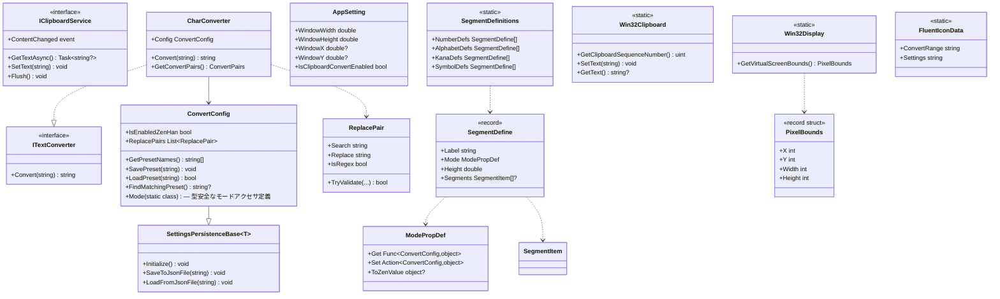
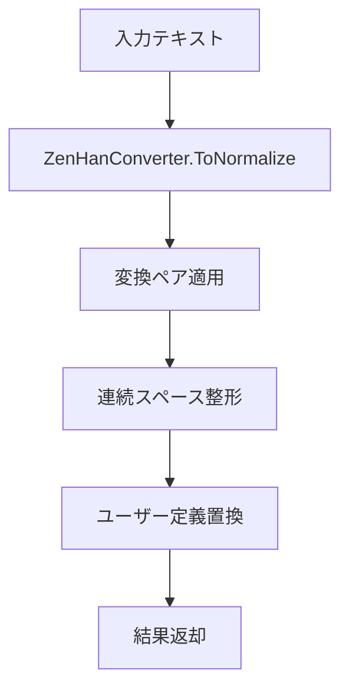

# ClipboardZenHanConverter.Core システム仕様書

本ドキュメントは `src/core` プロジェクトのシステム仕様（概要・アーキテクチャ・構成・変換フロー）を記載します。
メソッド内部のコードは記載しません。

## システム概要

`src/core` はクリップボードの全角/半角自動変換のコアロジック・データモデル・Win32 API ラッパーを提供するライブラリです。
**MewUI にも WinUI3 にも依存しない**ため、WinUI 3 版・MewUI 版の双方で共有できます。

## 技術スタック

- .NET 10
- CommunityToolkit.Mvvm 8.*
- EsUtil.Text.ZenHanConverter 1.*（全角/半角変換ペア）
- Win32 API（`user32.dll` の P/Invoke。UI フレームワーク非依存）
- Fluent Icons の SVG アセット（埋め込みリソース。パスデータは UI フレームワーク非依存の文字列として提供）

## アーキテクチャ

```text
src/core
├── Enums/        変換モード列挙型（値オブジェクト）
├── Models/       データモデル（ConvertConfig ほか）と変換カテゴリ定義（SegmentDefinitions）
├── Interfaces/   抽象化（DIP 用）
├── Logic/        変換ロジック（CharConverter）と変更検出（ClipboardChangeDetector）
├── Helpers/      変換ペア解決拡張、ウィンドウ位置補正、上下分割比率
├── Geometry/     DIP 座標の幾何型（UI フレームワーク非依存）
├── Native/       Win32 API ラッパー（UI フレームワーク非依存）
└── Icons/        Fluent Icons の SVG アセットとパスデータ提供
```

依存方向は単一方向（Helpers → Enums/Models/Geometry、Logic → Enums/Models/Helpers/Interfaces/Native、Native → Geometry、Icons → なし）です。
UI（`src/app_MewUI`）は `Interfaces` と `Logic`・`Models`・`Helpers`・`Geometry`・`Native`・`Icons` を参照します（`INavigationService` は UI 要素を返すため App 層に配置）。

## クラス図



## 変換フロー



`CharConverter.Convert` の処理順序:

1. null / 空文字チェック
2. 全角/半角変換（常に実行）
3. ユーザー定義置換（常に適用）

変換を実行するか否かは呼び出し側（画面側）のポリシーです。`ConvertConfig.IsEnabledZenHan` は現在の両アプリ（MewUI 版・WinUI 3 版）とも参照せず、変換エンジンも参照しません。

## 設定の自動保存

`SettingsPersistenceBase<T>` がプロパティ変更を監視し、300ms のデバウンス後に JSON ファイルへ保存します。
保存先は `%LOCALAPPDATA%\ClipboardZenHanConverter\` 配下（`Settings.json` / `AppSetting.json`）。

## テスト

`test/core` 配下にソースファイル每の単体テストを置きます（xUnit v3）。
ファイルを書き込むテストでは、実ユーザーの設定ファイルを汚さないよう `AutoSaveFileName` を一時ディレクトリへ差し替えます。

| テスト | 対象 |
| --- | --- |
| `Logic/CharConverterTests` | 変換モード別の変換、置換ルール、ペアのキャッシュと破棄 |
| `Models/ConvertConfigTests` | 既定値、`Mode` アクセサ、プリセット、エクスポート/インポート |
| `Models/ReplacePairTests` | 検証ロジックと値の等価性 |
| `Models/SegmentItemTests` | `SegmentItem` / `SegmentDefine` の値の保持 |
| `Models/AppSettingTests` | 既定値と JSON からの復元 |
| `Models/SettingsPersistenceBaseTests` | JSON 入出力とリソース解放 |
| `Models/SegmentDefinitionsTests` | セグメント定義の項目・ラベル・モード接続 |
| `Helpers/ZenHanConverterExtensionTests` | モード別の変換ペア解決 |
| `Helpers/WindowPlacementTests` | 表示領域内への位置補正（純粋ロジック） |
| `Helpers/SplitLayoutTests` | 上下分割比率の換算と上下限の補正（純粋ロジック） |
| `Geometry/PointDTests` / `SizeDTests` / `RectDTests` | DIP 幾何型の値の保持と端座標の算出 |
| `Logic/ClipboardChangeDetectorTests` | シーケンス番号による変更検出 |
| `Native/Win32DisplayTests` | 仮想画面の取得（正の幅・高さ） |
| `Native/Win32ClipboardTests` | クリップボードシーケンス番号の取得 |
| `Icons/FluentIconDataTests` | SVG パスデータの抽出とキャッシュ |

`SetText` は実ユーザーのクリップボード内容を破壊するため、単体テストでは検証しません。

## 例外処理ポリシー

- 設定ファイルの読み書き失敗（IOException / UnauthorizedAccessException / JsonException）は握り潰し、アプリ動作を継続。
- ユーザー定義の正規表現が不正な場合は該当ルールをスキップして処理継続。
