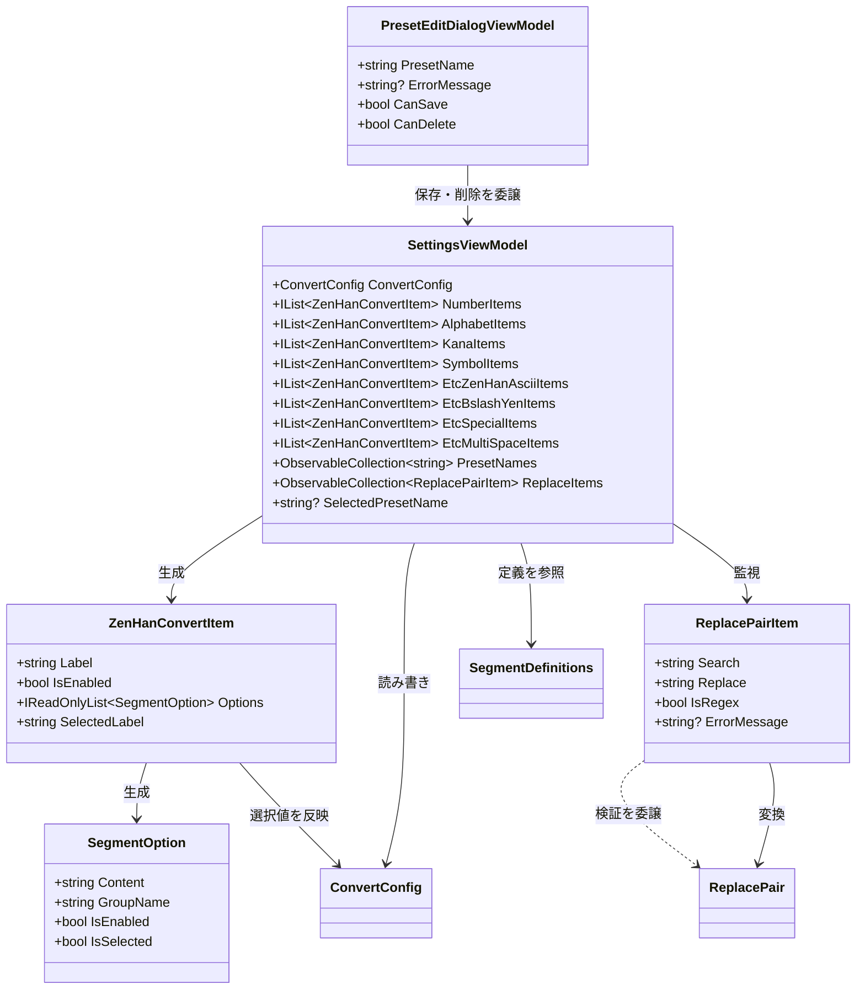
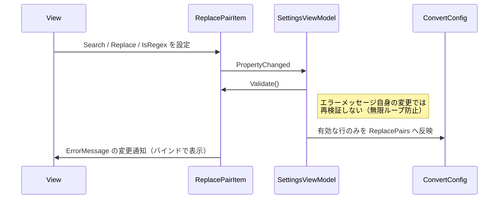

# ClipboardZenHanConverter.Presentation システム仕様書

本ドキュメントは `src/core_presentation`（UI フレームワーク非依存のプレゼンテーション層）の内部設計を記載します。
メソッド内部のコードは記載しません。

## システム概要

設定画面の ViewModel を 4 つの UI 実装（MewUI 版 / WinUI 3 版 / Avalonia UI 版 / WinForms 版）で共有するためのライブラリです。
UI フレームワークの型を一切参照せず、`src/core` と `CommunityToolkit.Mvvm` のみに依存します。

## 技術スタック

- .NET 10
- CommunityToolkit.Mvvm 8.*（`ObservableObject` / `[ObservableProperty]` / `[RelayCommand]`）
- `src/core`（モデル・変換ロジック・カテゴリ定義）

## 位置づけ

```text
┌──────────────────────────────────────────────────────────────┐
│ App 層（UI フレームワーク依存）                               │
│   app_MewUI / app_WinUI3 / app_AvaloniaUI / app_WinForms      │
│   ・View（画面の構築）                                        │
│   ・HomeViewModel（UI スレッド委譲がフレームワーク固有）      │
│   ・Services（クリップボード監視・ナビゲーション）            │
└───────────────────────────┬──────────────────────────────────┘
                            │ 一方向依存（参照のみ）
┌───────────────────────────▼──────────────────────────────────┐
│ Presentation 層（本プロジェクト・UI フレームワーク非依存）    │
│   SettingsViewModel / ZenHanConvertItem / SegmentOption       │
│   ReplacePairItem / PresetEditDialogViewModel                 │
│   HomeDisplayText（共有する表示文言）                         │
└───────────────────────────┬──────────────────────────────────┘
                            │ 一方向依存（参照のみ）
┌───────────────────────────▼──────────────────────────────────┐
│ Core 層（UI フレームワーク非依存）                            │
│   ConvertConfig / SegmentDefinitions / CharConverter          │
│   Win32Clipboard / WindowPlacement / ScreenVisibleArea ほか   │
└──────────────────────────────────────────────────────────────┘
```

逆方向の依存はありません。Presentation 層は UI の型（`Control` / `Window` / `Dispatcher` 等）を参照しないため、
ヘッドレスで単体テストできます。

## 共通化の経緯と効果

共通化前は、同じ ViewModel が 4 つのアプリに重複していました。

| 型 | app_MewUI | app_WinUI3 | app_AvaloniaUI | app_WinForms | 計 |
| --- | --- | --- | --- | --- | --- |
| `SettingsViewModel` | 242 行 | 246 行 | 277 行 | 277 行 | 1042 行 |
| `ZenHanConvertItem` | 92 行 | 92 行 | 143 行 | 143 行 | 470 行 |
| `ReplacePairItem` | 55 行 | 51 行 | 58 行 | 58 行 | 222 行 |
| `PresetEditDialogViewModel` | — | — | 161 行 | 161 行 | 322 行 |
| `SegmentOption` | — | — | 38 行 | 38 行 | 76 行 |
| **計** | | | | | **2132 行** |

実装は 2 系統（MewUI 版 ≡ WinUI 3 版 / Avalonia UI 版 ≡ WinForms 版）に分かれており、
系統内の差異は名前空間の行のみ、系統間の差異は `Options`（選択肢ごとのバインド）の有無でした。
機能差も生じており、MewUI 版・WinUI 3 版は置換ルールの編集が即時検証されない状態でした。

1 実装へ統一した結果、**2132 行 → 677 行（−1455 行）** となり、機能差も解消しています。

## アーキテクチャ



## コンポーネント構成

| コンポーネント | 責務 |
| --- | --- |
| `SettingsViewModel` | 8 カテゴリの変換設定、置換ルール、プリセット、JSON 入出力の状態を保持し、`ConvertConfig` と同期する |
| `ZenHanConvertItem` | 1 つの変換設定に対応する表示項目。排他選択の確定を単一所有する |
| `SegmentOption` | 排他選択の表示状態のみを持つ（設定値は持たない） |
| `ReplacePairItem` | 置換ルール 1 行の編集値と検証結果を保持する |
| `PresetEditDialogViewModel` | プリセット名の検証と保存・削除の可否を判断する |
| `HomeDisplayText` | ホーム画面が共有する表示文言の単一所有元 |

## 排他選択の同期

排他選択は、UI フレームワークによって表現方法が異なります。本プロジェクトは 2 つの窓口を提供し、
どちらからでも同じ設定値へ到達できるようにしています。

```mermaid
sequenceDiagram
    participant UI as View
    participant Item as ZenHanConvertItem
    participant Option as SegmentOption
    participant Config as ConvertConfig

    Note over UI,Config: 経路 1: 選択肢ごとのコントロール（Avalonia UI 版・WinForms 版）
    UI->>Option: IsSelected = true
    Option->>Item: PropertyChanged(IsSelected)
    Item->>Config: ModePropDef.Set（型安全なデリゲート）
    Item->>Item: SyncOptionsFromConfig で他の選択肢を解除

    Note over UI,Config: 経路 2: 選択値を 1 つで表すコントロール（MewUI 版・WinUI 3 版）
    UI->>Item: SelectedLabel = "半角"
    Item->>Config: ModePropDef.Set
    Item->>Item: SyncOptionsFromConfig
    UI->>Option: IsSelected を双方向バインドで受け取る

    Note over UI,Config: 経路 3: 設定側からの変更（プリセット読み込み・インポート）
    Config->>Item: PropertyChanged
    Item->>Item: SyncOptionsFromConfig
    Item->>UI: SelectedLabel / Options の変更通知
```

循環更新は `_isSyncing` フラグで防止します。

## 置換ルールの即時反映

`SettingsViewModel` は `ReplacePairItem` の変更通知を購読し、編集内容を検証して設定へ反映します。



`ReloadReplaceItemsFromConfig` で一覧を作り直す場合は、作り直す前に必ず全行の購読を解除します
（解除しないと古い行が購読され続けます）。

## プリセット選択の単一所有

`SelectedPresetName` は本プロジェクトが単一所有し、タイトルバーと設定画面の双方が同じ値をバインドします。
再帰的な読み込みは `_isUpdatingSelection` フラグで防止します。

| 変更の発生源 | 動作 |
| --- | --- |
| UI のドロップダウンで選択 | `LoadPreset` を実行して設定へ反映 |
| 設定が変更された（プリセットと一致） | `FindMatchingPreset` の結果を名前へ自動設定 |
| 設定が変更された（一致なし） | 名前を未選択にする |

## テストプロジェクト

`test/core_presentation` が本プロジェクトの単体テストを持ちます。

```text
test/core_presentation
├── AssemblyInfo.cs                          並列実行の無効化（プリセット保存先がプロセス全体で共有されるため）
└── ViewModels/
    ├── SettingsViewModelTests.cs            項目生成・設定同期・置換ルール・プリセット・JSON 入出力
    ├── ZenHanConvertItemTests.cs            排他選択・設定同期・通知・破棄
    ├── ReplacePairItemTests.cs              既定値・検証・変換・変更通知
    ├── PresetEditDialogViewModelTests.cs    名前の検証状態遷移・保存・削除
    └── SettingsInitPerformanceTests.cs      初期化と Expression.Compile のコスト計測
```

ファイルを書き込むテストは、実ユーザーの設定を汚さないよう
`SettingsPersistenceBase.AutoSaveFileName` と `ConvertConfig.PresetDirectory` を一時ディレクトリへ差し替えます。

## 例外処理ポリシー

- 設定ファイルの読み書きは Core の `SettingsPersistenceBase` が握り潰します（自動保存はベストエフォート）。
- 本プロジェクトが独自に例外を送出するのは、置換ルールの検証結果を返す場合のみです（戻り値で表現し、例外は投げません）。

## 各 UI との関係

| 項目 | 内容 |
| --- | --- |
| 参照方法 | 各アプリの ViewModel・View が `using EsUtil.ClipboardZenHanConverter.Presentation.ViewModels;` を宣言する |
| XAML からの参照 | `xmlns:vm="using:EsUtil.ClipboardZenHanConverter.Presentation.ViewModels"` |
| `HomeViewModel` | 本プロジェクトに含めない（UI スレッドへの委譲方法がフレームワークごとに異なるため） |
| `MainWindowViewModel` | 本プロジェクトに含めない（画面解決が UI の型に依存するため） |
| ナビゲーション項目 | アイコン表現が UI の型（`Geometry` / `NavigationIcon` 等）に依存するため各アプリに残す |
